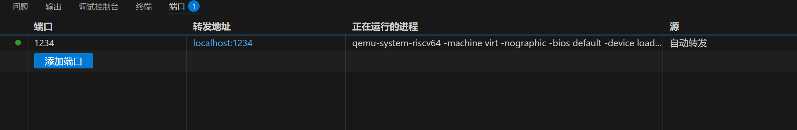
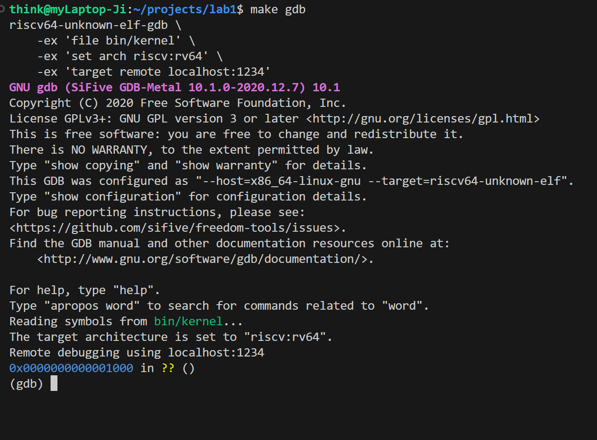
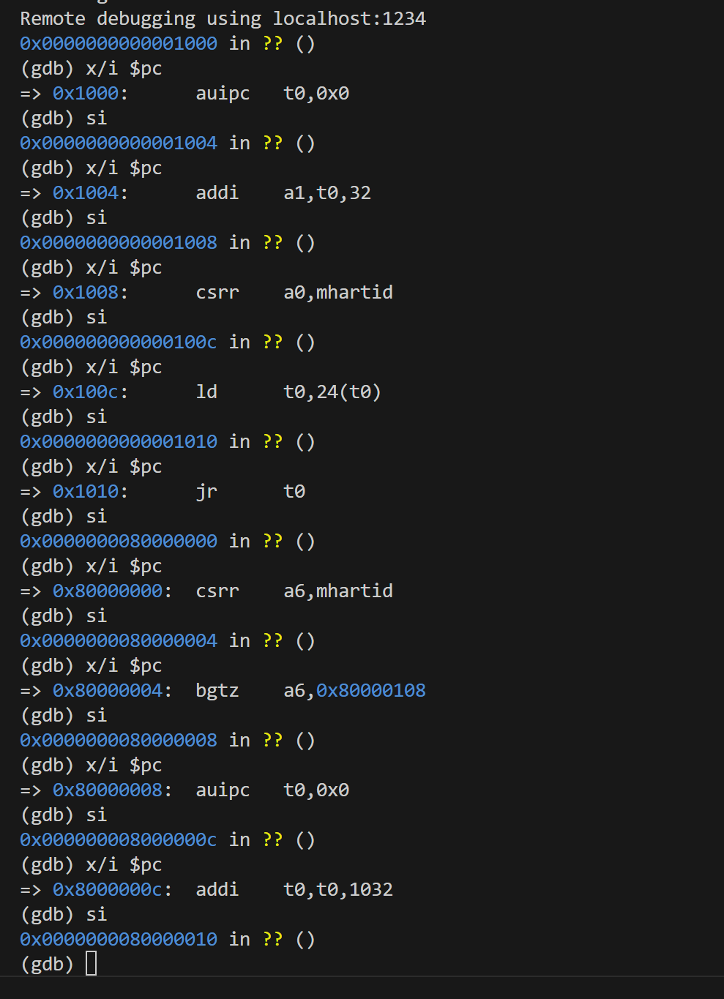
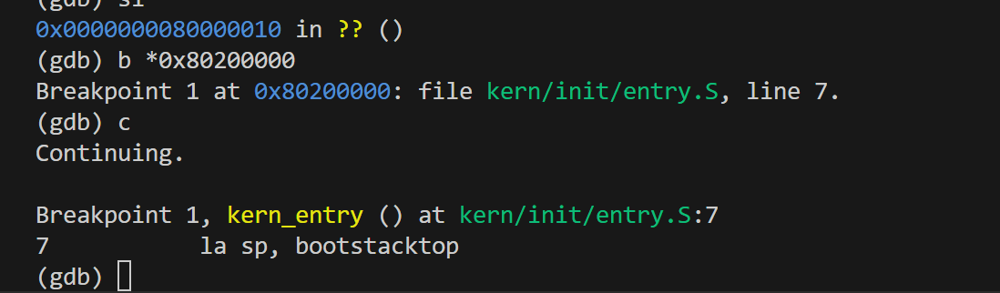
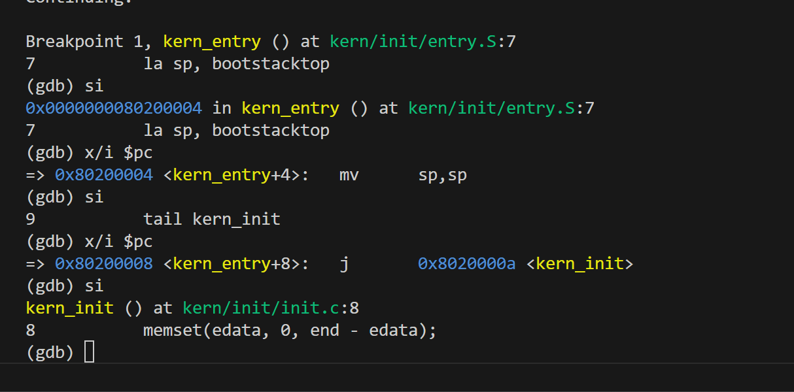

# Lab1

## 练习一

```
阅读 kern/init/entry.S内容代码，结合操作系统内核启动流程，说明指令 la sp, bootstacktop 完成了什么操作，目的是什么？ tail kern_init 完成了什么操作，目的是什么？
```


1. `la sp,bootstacktop`：`la`全称为`load address`，所以该指令将`bootstacktop`所对应的地址加载到了`sp`(stack pointer,栈指针)寄存器，目的是为即将运行的内核代码分配栈空间。
2. `tail kern_init`：进行尾调用（tail call），它会直接跳转到 `kern_init` 函数的地址开始执行，并且不会在栈上保存返回地址，目的是将控制权从汇编代码永久地转交给`kern_init`这个内核的 C 语言初始化函数。

## 练习二

```
为了熟悉使用 QEMU 和 GDB 的调试方法，请使用 GDB 跟踪 QEMU 模拟的 RISC-V 从加电开始，直到执行内核第一条指令（跳转到 0x80200000）的整个过程。通过调试，请思考并回答：RISC-V 硬件加电后最初执行的几条指令位于什么地址？它们主要完成了哪些功能？请在报告中简要记录你的调试过程、观察结果和问题的答案。
```

调试过程：

（1）启动`QEMU`：

使用命令`make debug`，它会按照Makefile中的`debug` 规则，使用 `-s -S` 参数启动 `QEMU`，且在1234这个端口上等待被连接



（2）启动`gdb`进行连接：

在新终端里使用命令`make gdb`，它会执行 `Makefile` 中的 `gdb` 规则，进行以下操作

```makefile
gdb:
	riscv64-unknown-elf-gdb \ #启动GDB客户端
    -ex 'file bin/kernel' \   #加载内核文件
    -ex 'set arch riscv:rv64' \ #设置目标架构为RISC-V 64位
    -ex 'target remote localhost:1234'  #连接到在本地1234端口等待的目标（即QEMU）
```

结果如下：



`Reading symbols from bin/kernel...` 表示`gdb`已经成功加载了内核文件 `bin/kernel`

`The target architecture is set to "riscv:rv64"`表示目标架构已经设置为了RISC-V 64位

`Remote debugging using localhost:1234` 表示`gdb`作为客户端，已经成功连接上了在第一个终端中运行的`QEMU`服务器

`0x0000000000001000 in ?? ()` 为程序暂停的位置，即：

- `0x0000000000001000`：这是CPU程序计数器（PC）当前的值，也就是下一条要执行的指令所在的内存地址。这个地址是RISC-V硬件上电后开始执行的固定入口地址。
- `in ?? ()`：`??`表示`gdb`不认识这个地址对应的函数名，因为现在所在的代码区域是QEMU模拟的固件（OpenSBI），而不是内核代码，所以`gdb`没有它的符号信息。

（3）查看硬件加电以后最初的几条指令

一直使用`x/i $pc`和`si`来分别查看当前指令和执行下一条指令，结果如下：



回答一：RISC-V 硬件加电后最初执行的几条指令位于什么地址？它们主要完成了哪些功能？

| 阶段        | 地址         | 指令                 | 详细功能                                                     |
| ----------- | ------------ | -------------------- | ------------------------------------------------------------ |
| **MROM**    | `0x1000`     | `auipc t0,0x0`       | 将当前指令的地址 `0x1000` 加载到 `t0` 寄存器，为后续基于当前位置的地址计算做准备。 |
| **MROM**    | `0x1004`     | `addi a1,t0,32`      | 计算出 `0x1020` (`0x1000 + 32`) 这个地址并存入 `a1`。`a1` 是标准函数调用的第二个参数寄存器，这里用于向下一阶段程序传递一个指向硬件配置信息的指针。 |
| **MROM**    | `0x1008`     | `csrr a0,mhartid`    | 读取当前执行此代码的CPU核心的唯一ID (`mhartid`)，并存入 `a0`。`a0` 是第一个参数寄存器，用于告知下一阶段程序“我是第X号核心”。 |
| **MROM**    | `0x100c`     | `ld t0,24(t0)`       | 从一个预先约定好的固定内存地址 `0x1018` (`0x1000 + 24`) 读取一个64位的地址值，并将其存入 `t0`。这个值就是下一阶段引导程序（OpenSBI）的入口地址。 |
| **MROM**    | `0x1010`     | `jr t0`              | 执行一次直接跳转，将CPU的控制权从MROM移交给 `t0` 寄存器中存储的地址（即`0x80000000`） |
| **OpenSBI** | `0x80000000` | `csrr a6,mhartid`    | 固件开始执行后，再次读取当前CPU核心ID，为接下来的多核处理逻辑做准备。 |
| **OpenSBI** | `0x80000004` | `bgtz a6,0x80000108` | 判断核心ID是否大于0。如果是从核心（ID>0），则跳转到另一段代码路径，通常是使其休眠或等待；只有主核心（ID=0）会继续执行主要的初始化流程，避免多核同时初始化系统造成冲突。 |
| …           |              |                      |                                                              |

即第一阶段 (MROM) 功能为：1) 收集并准备好下一阶段程序所必需的最基本参数（核心ID、硬件信息地址）；2) 跳转到下一阶段程序的入口地址。第二阶段 (OpenSBI) 进行系统初始化，最终加载操作系统内核文件，并将CPU的控制权最终交给内核。

（4）转到内核入口地址

使用命令`b *0x80200000`打断点，`c`执行到断点，可以看到下图到了内核的第一条指令`7 la sp, bootstacktop`



继续执行可以看到运行完`9 tail kern_init`以后，转到了`kern_init`的入口地址，之后进行初始化内核。

