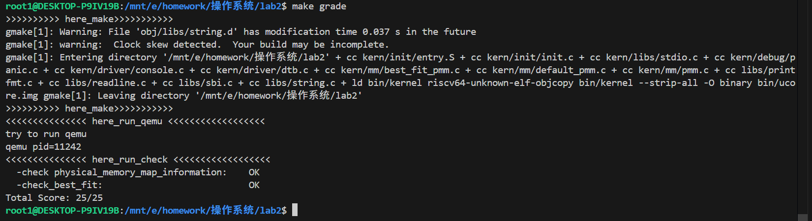
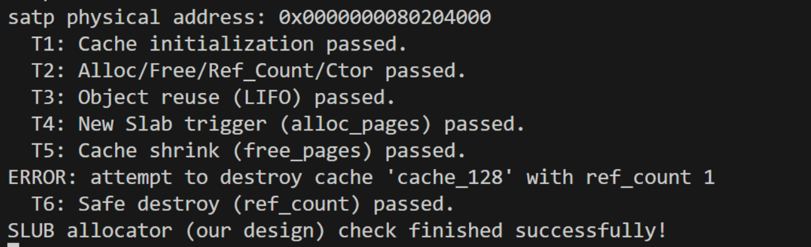

# Lab2物理内存和页表

## 练习1：理解first-fit 连续物理内存分配算法（思考题）

> first-fit 连续物理内存分配算法作为物理内存分配一个很基础的方法，需要同学们理解它的实现过程。请大家仔细阅读实验手册的教程并结合`kern/mm/default_pmm.c`中的相关代码，认真分析default_init，default_init_memmap，default_alloc_pages， default_free_pages等相关函数，并描述程序在进行物理内存分配的过程以及各个函数的作用。 请在实验报告中简要说明你的设计实现过程。请回答如下问题：
>
> - 你的first fit算法是否有进一步的改进空间？


### 一、实现过程的理解

物理内存管理模块以链表维护连续空闲页的方式实现页级内存分配。系统启动后，内核根据探测到的可用物理内存区间调用初始化函数建立空闲页链表。每个物理页由 `struct Page` 描述，字段 `property` 仅在块头页上记录该块的页数，`PG_property` 标志该页为块头页，`page_link` 将块头页连接入 `free_list`。全局变量 `free_area` 维护空闲页链表头及空闲页计数 `nr_free`。链表按照物理地址有序排列，保证释放时只需检查前后节点即可判断是否相邻并合并，从而维持空闲块连续性。First-Fit 算法基于此结构实现，从头开始扫描空闲链表，找到第一个能容纳所需页数的空闲块进行分配或切分。

### 二、相关函数的分析

`default_init` 负责初始化空闲链表，将 `free_list` 置为空并清零计数，为后续挂载空闲块做准备。  
`default_init_memmap` 接受物理页起始地址和页数，将指定区间初始化为空闲块：清除每页的标志与引用计数，只在首页设置 `property=n` 并标记为块头，然后将其按地址序插入链表并更新 `nr_free`。  
`default_alloc_pages` 执行分配逻辑，从链表头开始顺序遍历，遇到第一个 `property>=n` 的块即命中；若块长等于 n，直接摘链返回；若更大，则切下前 n 页返回，将剩余页构成新的空闲块插回原位置，更新空闲页数。  
`default_free_pages` 处理释放，恢复指定区间为可用状态，在首页设置 `property=n` 并标记后插入空闲链表中，保持地址有序，然后检测并合并与前后相邻的空闲块，删除被合并的块头节点，更新块长与 `nr_free`。

### 三、各个函数的作用
`default_init` 用于建立干净的空闲链表环境；  
`default_init_memmap` 将探测到的可用内存映射为空闲块；  
`default_alloc_pages` 完成物理页的分配与块的切割；  
`default_free_pages` 实现页块的回收与邻接块合并。  
四个函数共同维持空闲页链表的正确性与全局计数的精确性，使得分配与释放操作在链表层面相互平衡。

### 四、程序在进行物理内存分配的过程
系统初始化阶段通过 `init_memmap` 将所有可用物理内存分块挂入空闲链表。执行分配请求时，分配函数从链表首节点开始扫描，依据 First-Fit 策略选择第一个能容纳所需页数的空闲块。如果该块大小恰好等于请求值，直接摘链返回；若更大，则切割为分配区与剩余区，前者返回使用，后者重新入链。释放操作则将回收区间转化为空闲块按地址插回链表，并检查前后邻接块是否连续，若连续则合并为更大的块。通过这种“分配切分、释放合并”的循环，系统动态维护一张有序空闲页表，实现物理内存的高效复用。

### 五、设计实验过程
实验设计以验证内存分配器的正确性和一致性为目标。  
首先，通过初始化阶段检查空闲页数与可用区间一致；  
其次，在多次分配与释放操作后验证 `nr_free_pages()` 与链表长度之和保持不变；  
再次，通过构造连续分配与交错释放的测试序列，观察块的切分与合并是否正确；  
最后，利用系统自检函数检查各页标志位是否符合规范，确保仅块头页带有 `PG_property`，链表严格按物理地址递增且无交叠或断裂。  
实验过程体现了链表结构与算法逻辑的一致性验证方法。

### 六、First-Fit 的改进
First-Fit 算法结构简单、实现容易，但存在线性扫描开销和外部碎片问题。可改进的方向包括：采用 Next-Fit 策略从上次命中处继续搜索以减少链表前段遍历；采用 Best-Fit 策略在所有可用块中选择最小可容纳块以降低外部碎片；引入按块大小分类的分离适配机制减少查找复杂度；使用平衡树或跳表按大小有序存储空闲块实现对数级查找；在更高层面引入伙伴系统以对齐块大小到 2 的幂，实现常数时间的分配与合并。以上改进能够在保持正确性的前提下提升内存利用率与分配效率，从而优化物理内存管理的整体性能。


## 练习2：实现 Best-Fit 连续物理内存分配算法（需要编程）

> 在完成练习一后，参考kern/mm/default_pmm.c对First Fit算法的实现，编程实现Best Fit页面分配算法，算法的时空复杂度不做要求，能通过测试即可。 请在实验报告中简要说明你的设计实现过程，阐述代码是如何对物理内存进行分配和释放，并回答如下问题：
>
>- 你的 Best-Fit 算法是否有进一步的改进空间？


### 一、设计思路

本实验在 uCore 的物理内存管理框架下实现了 **Best-Fit 连续页分配算法**。系统通过 `pmm_manager` 接口封装不同策略的物理页管理器，实现时只需定义对应的 `best_fit_pmm_manager` 并实现相关函数。

设计核心如下：

- **空闲页管理结构**：使用一个 `free_area_t` 实例，其中 `free_list` 是双向链表，按物理地址递增顺序存储空闲块；`nr_free` 记录当前空闲页总数。  
- **页块信息**：每个空闲块的首页通过 `Page.property` 记录块大小（页数），并将 `PageProperty` 标志位置 1。
- **主要操作**：
  1. 初始化空闲块链表；
  2. 分配时在空闲块中查找“刚好能容纳请求的最小块”（Best-Fit）；
  3. 若块大于需求，切分出剩余部分；
  4. 释放时按地址顺序插入，并尝试与前后相邻空闲块合并。

---

### 二、关键数据结构与函数说明

#### 1. 新增的全局结构与辅助函数

```c
// 内部维护的空闲块区域
static free_area_t free_area;

#define free_list (free_area.free_list)
#define nr_free   (free_area.nr_free)
```

`free_area` 用于管理所有空闲页块；链表按物理地址有序，便于在释放时判断相邻页是否可合并。

#### 插入函数（按地址顺序）

```c
static void insert_block_by_addr(struct Page *base) {
    if (list_empty(&free_list)) {
        list_add(&free_list, &(base->page_link));
        return;
    }
    list_entry_t *le = &free_list;
    while ((le = list_next(le)) != &free_list) {
        struct Page *page = le2page(le, page_link);
        if (base < page) {
            list_add_before(le, &(base->page_link));
            return;
        }
        if (list_next(le) == &free_list) {
            list_add(le, &(base->page_link));
            return;
        }
    }
}
```

按物理地址排序插入的原因：

- 方便释放时直接判断相邻页；
- 保证 `free_list` 的有序性；
- 后续 `try_merge_neighbors()` 能 O(1) 检查前后合并。

#### 合并相邻空闲块

```c
static void try_merge_neighbors(struct Page *base) {
    list_entry_t *ple = list_prev(&(base->page_link));
    if (ple != &free_list) {
        struct Page *prev = le2page(ple, page_link);
        if (prev + prev->property == base) {
            prev->property += base->property;
            ClearPageProperty(base);
            list_del(&(base->page_link));
            base = prev;
        }
    }
    list_entry_t *nle = list_next(&(base->page_link));
    if (nle != &free_list) {
        struct Page *next = le2page(nle, page_link);
        if (base + base->property == next) {
            base->property += next->property;
            ClearPageProperty(next);
            list_del(&(next->page_link));
        }
    }
}
```

---

#### 2. 初始化阶段

```c
static void best_fit_init(void) {
    list_init(&free_list);
    nr_free = 0;
}

static void best_fit_init_memmap(struct Page *base, size_t n) {
    assert(n > 0);
    for (struct Page *p = base; p != base + n; p++) {
        p->flags = 0;
        set_page_ref(p, 0);
        p->property = 0;
        ClearPageProperty(p);
    }
    base->property = n;
    SetPageProperty(base);
    insert_block_by_addr(base);
    nr_free += n;
}
```

初始化函数清空状态，建立初始空闲链表。  
`base->property` 记录连续空闲页数，并插入链表。

---

#### 3. 分配函数（Best-Fit 核心逻辑）

```c
static struct Page *best_fit_alloc_pages(size_t n) {
    assert(n > 0);
    if (n > nr_free) return NULL;

    struct Page *best = NULL;
    size_t best_size = (size_t)-1;

    // 遍历所有空闲块，找出最小可用块
    list_entry_t *le = &free_list;
    while ((le = list_next(le)) != &free_list) {
        struct Page *p = le2page(le, page_link);
        if (PageProperty(p) && p->property >= n && p->property < best_size) {
            best = p;
            best_size = p->property;
            if (best_size == n) break; // 精确匹配立即结束
        }
    }
    if (best == NULL) return NULL;

    list_entry_t *prev = list_prev(&(best->page_link));
    list_del(&(best->page_link));

    // 若块大于需求，切分剩余部分并重新插入
    if (best->property > n) {
        struct Page *remain = best + n;
        remain->property = best->property - n;
        SetPageProperty(remain);
        list_add(prev, &(remain->page_link));
    }

    nr_free -= n;
    ClearPageProperty(best);
    return best;
}
```

该函数遍历整个空闲链表，挑选出满足条件的最小块，实现“最佳匹配”分配。  
若块大于请求页数，则切割并重新插入剩余部分。

---

#### 4. 释放函数

```c
static void best_fit_free_pages(struct Page *base, size_t n) {
    assert(n > 0);
    for (struct Page *p = base; p != base + n; p++) {
        p->flags = 0;
        set_page_ref(p, 0);
    }
    base->property = n;
    SetPageProperty(base);
    insert_block_by_addr(base);
    nr_free += n;
    try_merge_neighbors(base);
}
```

释放时重新插入空闲链表并调用 `try_merge_neighbors`，保证相邻空闲块能及时合并，减少外部碎片。

---

#### 5. 管理器结构体定义

```c
static size_t best_fit_nr_free_pages(void) { return nr_free; }

static void best_fit_check(void) {
    size_t before = nr_free;
    struct Page *p = best_fit_alloc_pages(1);
    assert(p != NULL);
    best_fit_free_pages(p, 1);
    assert(nr_free == before);
}

const struct pmm_manager best_fit_pmm_manager = {
    .name          = "best_fit_pmm_manager",
    .init          = best_fit_init,
    .init_memmap   = best_fit_init_memmap,
    .alloc_pages   = best_fit_alloc_pages,
    .free_pages    = best_fit_free_pages,
    .nr_free_pages = best_fit_nr_free_pages,
    .check         = best_fit_check,
};
```

此结构将 Best-Fit 管理逻辑与系统物理内存管理框架连接，使 `pmm_init()` 能正确调用并输出。

---

### 三、实现流程概述

1. 系统启动后，内核从设备树 (DTB) 读取物理内存范围。  
2. 建立页结构体数组 `pages[]`，为每一页生成 `struct Page`。  
3. 调用 `best_fit_init_memmap()` 初始化空闲链表。  
4. 分配内存时调用 `best_fit_alloc_pages(n)` 查找最小可用块；若块过大则切分。  
5. 释放内存时调用 `best_fit_free_pages()` 插入并自动合并相邻块。  
6. 系统在 `pmm_init()` 中调用 `pmm_manager->check()` 自检并输出测试信息。

---

实验结果如下：

可以看到，我们很好的通过了测试！

### 四、算法特性与改进空间

当前实现能正确完成页分配与回收，减少空间浪费，满足测试要求。  
但仍存在以下可优化点：

- **查找复杂度高**：每次分配需遍历整个链表，复杂度为 O(k)。可维护一个按块大小排序的树结构或多级空闲链，将分配降至 O(log k) 或近似 O(1)。  
- **碎片控制不足**：可设置最小切分粒度，或通过延迟合并减少过小残块。  
- **并发性能**：当前全局链表无锁，无法并行访问。可增加自旋锁或每 CPU 独立空闲区。  
- **调试增强**：可增加双重释放检测、内存污染标识与链表一致性检查。


## 扩展练习Challenge：buddy system（伙伴系统）分配算法（需要编程）

>Buddy System算法把系统中的可用存储空间划分为存储块(Block)来进行管理, 每个存储块的大小必须是2的n次幂(Pow(2, n)), 即1, 2, 4, 8, 16, 32, 64, 128...
>
>- 参考[伙伴分配器的一个极简实现](http://coolshell.cn/articles/10427.html)， 在ucore中实现buddy system分配算法，要求有比较充分的测试用例说明实现的正确性，需要有设计文档。

# Buddy System 物理页分配器设计文档

**实现文件**

	kern/mm/buddy_pmm.c
	kern/mm/buddy_pmm.h

---

## 1. 设计目标与背景

uCore 的物理内存管理（PMM）框架通过 `struct pmm_manager` 提供统一接口，以支持多种分配策略，如 First-Fit、Best-Fit 等。Buddy System（伙伴系统）是一种结构清晰、效率较高的页级内存分配方式。

它的基本思想是：将物理内存按页（4KiB）划分，并以 **2 的幂次方**大小管理内存块。`order = k` 表示块大小为 `2^k` 页。分配时，将请求页数向上取整到最近的 2 的幂，若无匹配块，则从更大块拆分；释放时，通过计算伙伴块位置，若伙伴空闲则合并为更大的块，持续进行直到无法再合并。

这种方法的时间复杂度仅与最大阶数有关，通常为常数级。相比需要遍历链表的 First-Fit 或 Best-Fit，Buddy System 更高效、逻辑更简洁，也能在一定程度上减少外部碎片。

---

## 2. 外部接口（与 uCore 对接）

通过 `buddy_pmm_manager` 接入 uCore：

```c
const struct pmm_manager buddy_pmm_manager = {
    .name = "buddy_pmm_manager",
    .init = buddy_init,
    .init_memmap = buddy_init_memmap,
    .alloc_pages = buddy_alloc_pages,
    .free_pages = buddy_free_pages,
    .nr_free_pages = buddy_nr_free_pages,
    .check = buddy_check,
};
```

> 集成：在 `kern/mm/pmm.c` 的 `init_pmm_manager()` 中设置 `pmm_manager = &buddy_pmm_manager;`。

---

## 3. 数据结构与关键状态

### 3.1 分阶空闲链表

```c
typedef struct {
    list_entry_t free_list;   // 该阶空闲块链表表头
    unsigned int nr_blocks;   // 该阶空闲块数量（块数，不是页数）
} buddy_area_t;

static buddy_area_t buddy_area[MAX_BUDDY_ORDER + 1];
```

 每个 `order` 对应一条空闲链表，链表元素是**空闲块的“头页”**。`nr_blocks` 用来快速统计该阶块数，便于计算总空闲页数。

### 3.2 受管物理页区间（Arena）

```c
static struct Page *arena_base;   // 管理的连续页区间起始指针
static size_t arena_npages;       // 管理的页数
```

`arena_base` 和 `arena_npages` 一起定义了当前分配器所管理的物理页范围。
### 3.3 Page 元信息使用约定

在伙伴系统中，每个空闲块由若干连续的页组成。为了方便识别，系统只在空闲块的头页中记录该块的元信息。

具体约定如下：
**空闲块头页（head page）**

 - `SetPageProperty(head)`：设置 `PG_property` 标志位
  - `head->property = order`：记录当前块的阶

**块中的其他页**

  - `PG_property` 清零
  - `property = 0`

这样设计有两个好处：

1. **合并判断更可靠**：释放时，只需检查页是否为“头页”且阶数是否匹配，就能确定两块是否为同阶的伙伴块。

2. **防止链表混乱**：避免错误地将块中间的某一页误认为新块的头页，从而破坏空闲链表结构或错误地进行合并。
---

## 4. 初始化流程

### 4.1 `buddy_init()`

```c++

static void buddy_init(void) {
    for (size_t i = 0; i <= MAX_BUDDY_ORDER; i++) {
        list_init(&(buddy_area[i].free_list));
        buddy_area[i].nr_blocks = 0;
    }
    arena_base = NULL;
    arena_npages = 0;
    buddy_inited = 1;
}
```
该函数用于初始化整个伙伴系统的内部结构，此时尚未管理任何物理页，需通过 `buddy_init_memmap()` 导入可用内存区间。

### 4.2 `buddy_init_memmap(base, n)`

```c++
static void buddy_init_memmap(struct Page *base, size_t n) {
    arena_base = base;
    arena_npages = n;
    for (size_t i = 0; i < n; i++) {
        struct Page *p = base + i;
        assert(PageReserved(p));
        ClearPageReserved(p);
        ClearPageProperty(p);
        p->property = 0;
        set_page_ref(p, 0);
    }
    // 贪心切分：在位置 i 选尽可能大的 2^k，要求 i 按 2^k 对齐，且 2^k 不超过剩余
    size_t i = 0;
    while (i < n) {
        size_t max_fit = 0, remain = n - i;
        size_t align_lsb = i ? __builtin_ctzll(i) : MAX_BUDDY_ORDER;
        (void)align_lsb;
        for (size_t k = 0; k <= MAX_BUDDY_ORDER; k++) {
            size_t sz = pages_of_order(k);
            if (sz > remain) break;
            if ((i & (sz - 1)) == 0) max_fit = k;
        }
        size_t k = max_fit;
        while (pages_of_order(k) > remain) k--;
        buddy_list_add(k, base + i);
        i += pages_of_order(k);
    }
}
```

负责建立 `[base, base+n)` 区间的页管理结构。主要包括两步：
1. 逐页清理,保证所有页从干净状态开始参与分配
2. 贪心对齐切分,保证每个块都按 2 的幂对齐，也让后续的伙伴合并更容易成功

---

## 5. 分配算法

### 5.1 `alloc_pages(n)` 的核心思路

```c++
static struct Page *buddy_alloc_pages(size_t n) {
    if (n == 0) return NULL;
    size_t need_order = ilog2_ceil(n);
    if (need_order > MAX_BUDDY_ORDER) return NULL;

    size_t k = need_order;
    while (k <= MAX_BUDDY_ORDER && buddy_area[k].nr_blocks == 0) k++;
    if (k > MAX_BUDDY_ORDER) return NULL;

    struct Page *block = buddy_list_pop(k);
    while (k > need_order) {
        k--;
        size_t half = pages_of_order(k);
        struct Page *second = block + half;
        buddy_list_add(k, second);
    }
    ClearPageProperty(block);
    for (size_t i = 0; i < pages_of_order(need_order); i++) {
        set_page_ref(block + i, 0);
    }
    return block;
}
```
1. 先将请求页数向上取整到最小的 2 的幂，得到目标阶 `need_order`。  
2. 从该阶开始向上寻找第一个非空链表，若找不到则返回 `NULL`。  
3. 取出该阶的一个空闲块，若阶数过大，就不断对半拆分：保留低地址半块，另一半重新挂回低一阶链表。  
4. 当拆分到目标阶后，清除块头标志并返回块头页。
## 6. 释放与合并算法

### 6.1 `free_pages(base, n)` 的核心思路

```c++
static void buddy_free_pages(struct Page *base, size_t n) {
    if (n == 0) return;
    size_t order = ilog2_ceil(n);
    if (order > MAX_BUDDY_ORDER) return;

    size_t idx = page_index(base);
    assert(idx < arena_npages);

    while (order < MAX_BUDDY_ORDER) {
        size_t buddy_idx = idx ^ pages_of_order(order);
        if (buddy_idx >= arena_npages) break;
        struct Page *buddy = index_page(buddy_idx);
        if (!(PageProperty(buddy) && buddy->property == order)) break;
        buddy_list_del(order, buddy);
        idx = (idx < buddy_idx) ? idx : buddy_idx;
        order++;
    }
    buddy_list_add(order, index_page(idx));
}
```


1. 先计算释放块的阶 `order = ceil_log2(n)`，并获得块的索引 `idx`。  
2. 通过异或运算 `idx ^ (1 << order)` 找到伙伴块索引。  
3. 如果伙伴块空闲且阶相同，则将两者合并成更大块并继续向上尝试；否则停止。  
4. 最后将合并后的块头页加入对应阶的空闲链表。


## 7. 统计与工具函数

```c++

static size_t buddy_nr_free_pages(void) {
    size_t total = 0;
    for (size_t k = 0; k <= MAX_BUDDY_ORDER; k++) {
        total += buddy_area[k].nr_blocks * pages_of_order(k);
    }
    return total;
}
```

`buddy_nr_free_pages()` 用于统计当前系统中剩余的空闲页数。
```c++
static inline size_t ilog2_ceil(size_t n) {
    size_t k = 0, s = 1;
    while (s < n) { s <<= 1; k++; }
    return k;
}
```
`ilog2_ceil(n)` 计算最小的 `k`，使得 `2^k` 不小于 `n`，分配和释放时都依赖该函数来确定阶数。

---

## 8. 自检用例（`buddy_check()`）


自检函数在 `pmm_init()` 阶段运行，用于验证伙伴系统分配与回收逻辑的正确性。测试内容包括以下三个部分：

1. **基础功能验证**  
    依次执行 `alloc(1)`、`alloc(2)`、`free(1)`、`alloc(3→4)`、`free(2)`、`free(3→4)`  
    
2. **多阶往返测试**  
    按照不同阶 `2^k` 依次进行分配与释放，直到块大小超过 `arena_npages/2` 为止。
      
3. **交错释放测试**  
    连续分配多个块，块大小循环取 `1..7` 页，并记录每次分配的实际请求  
    之后先释放偶数下标的块，再释放奇数下标的块，最后检查空闲页数是否恢复到初始值 。
---

## 13. 运行与评分

1. 在 `pmm.c` 选择管理器：

```c
  pmm_manager = &buddy_pmm_manager;
   ```

2. 若需要让自动评分脚本通过:
     在 `tools/grade.sh` 的 `check physical_memory_map_information` 处，将  `'memory management: best_fit_pmm_manager'`  修改为`'memory management: buddy_pmm_manager'`

评分结果如下所示：


## 扩展练习Challenge：任意大小的内存单元slub分配算法（需要编程）

>slub算法，实现两层架构的高效内存单元分配，第一层是基于页大小的内存分配，第二层是在第一层基础上实现基于任意大小的内存分配。可简化实现，能够体现其主体思想即可。
>
>- 参考[linux的slub分配算法/](https://github.com/torvalds/linux/blob/master/mm/slub.c)，在ucore中实现slub分配算法。要求有比较充分的测试用例说明实现的正确性，需要有设计文档。

### 概述与核心思想

本项目在 uCore 操作系统 中实现了一个 SLUB (Slab Allocator) 风格的内存分配器。其核心思想是采用**分层架构**，为内核中频繁分配和释放的**固定大小对象** 提供一个**专门化的高效缓存机制**。

* **第一层 (Layer 1 - 物理页管理)**：由底层的物理内存管理器（PMM，例如 `buddy_pmm_manager`，通过 `pmm.h` 接口访问）负责。它管理以**物理页 (Page)** 为单位的大块连续内存。

* **第二层 (Layer 2 - SLUB 对象管理)**：由本 `slub_pmm.c` 实现。它作为 Layer 1 的**客户**。它为**每种特定大小的对象** 维护一个**缓存管理器 (`kmem_cache`)**。

该管理器通过调用 `alloc_pages` 从 Layer 1 预先申请较大块的连续内存（称为 **Slab**，通常为一页或多页）。然后，这些 Slab 被内部格式化为多个大小正好符合目标对象的槽位，并通过**内部空闲链表 (`freelist`)** 进行管理。当分配请求到达时，SLUB 优先从缓存的 Slab 中快速取出一个空闲槽位（O(1) 操作）；当对象被释放时，它被快速归还到 Slab 的空闲链表（O(1) 操作），以便立即复用。这种方法避免了为每个小对象调用昂贵的页分配器，显著提高了分配/释放的效率，并通过对象复用和 Slab 整体回收减少了内存碎片。

### 设计目标与优势

本 SLUB 实现旨在实现以下目标：

* **提高效率**: 通过缓存预分配的对象，显著加快小对象的分配 (`kmem_cache_alloc`) 和释放 (`kmem_cache_free`) 速度，避免了每次都调用较慢的页级分配器 (`alloc_pages`)。
* **减少内存碎片**:
    * **内部碎片**: 通过为特定大小的对象创建专门的缓存 (`kmem_cache`)，尽量减少对象大小与分配单元大小不匹配造成的浪费。
    * **外部碎片**: 通过复用 Slab 内的对象槽位，以及在 Slab 完全空闲时将其占用的物理页 归还给底层 PMM，减少了因小内存分配/释放导致的物理内存碎片化。
* **内存复用**: 释放的对象 被快速放回 Slab 的空闲列表 (`freelist`)，立即可供下一次分配使用。

### 数据结构设计

* **`struct kmem_cache` (缓存管理器)**:
    管理特定大小对象的控制结构，用来管理众多slab。

    ```c
    struct kmem_cache {
        const char *name;           // 缓存的名称
        size_t object_size;         // 本缓存管理的固定块的大小（字节）
        list_entry_t slab_list;    // 缓存管理的 Slab 链表
        size_t slab_pages;          // 每个 Slab 包含的物理页数（本实现简化为 1）
        unsigned int objects_per_slab; // 每个 Slab 能容纳的固定大小块的数量
        unsigned int ref_count;     // 引用计数器
    };
    ```
    
* **`struct Slab` (Slab 容器)**:
    Slab 的元数据结构，嵌入在每个 Slab（物理页）的头部，其内部被分为许多固定大小内存的槽位。

    ```c
    struct Slab {
        struct kmem_cache *cache;   // 指回它所属的 kmem_cache
        list_entry_t slab_link;     // 用于链入 kmem_cache->slab_list
        void *freelist;             // 指向此 Slab 内部的第一个空闲对象
        unsigned int free_count;    // 此 Slab 当前的空闲块数量
    };
    ```

### 关键算法实现

* **`kmem_cache_init` (初始化)**:
    **作用**: 此函数用于初始化一个 `kmem_cache` 管理器结构体。它设置缓存名称、规范化对象大小（确保至少为指针大小）、计算每个 Slab 能容纳的对象数量，并将引用计数器初始化为零。

    ```c
    void kmem_cache_init(struct kmem_cache *cache, const char *name, size_t size) {
        cache->name = name;
        // 确保对象大小至少是一个指针的大小，因为空闲对象需要被串联起来
        cache->object_size = (size < sizeof(void *)) ? sizeof(void *) : size;
        
        // Slab固定为1物理页
        cache->slab_pages = 1;
        //计算结构体对齐后的大小
        size_t slab_metadata_size = ALIGN_UP(sizeof(struct Slab), sizeof(void *));
        
        // 除去Slab元数据后，还能放多少个对象
        unsigned int count = 0;
        size_t able_space = (PGSIZE * cache->slab_pages) - slab_metadata_size;
        if (able_space > cache->object_size) {
            count = able_space / cache->object_size;
        }
        cache->objects_per_slab = count;
        cache->ref_count = 0;
        list_init(&(cache->slab_list));
        assert(cache->objects_per_slab > 0); 
    }
    ```
    
* **`slab_create` (创建 Slab)**:
    **作用**: 负责创建一个新的 Slab 容器。它向底层物理页分配器申请内存，在内存头部初始化 Slab 元数据，并将剩余空间格式化为一个包含所有空闲对象的内部链表（`freelist`）

    ```c
    static struct Slab *slab_create(struct kmem_cache *cache) {
        // 向 Buddy System 申请 (物理页)
        struct Page *page = alloc_pages(cache->slab_pages);
        if (page == NULL) {
            return NULL;
        }
        //将物理页地址转换为内核虚拟地址
        uintptr_t pa = page2pa(page);
        void *va = KADDR(pa);
        // 初始化 Slab 结构体
        struct Slab *slab = (struct Slab *)va;
        slab->cache = cache;
        slab->free_count = cache->objects_per_slab;
        
        // 剩余空间串联成 freelist
        size_t slab_metadata_size = ALIGN_UP(sizeof(struct Slab), sizeof(void *));
        void *obj_start = (char *)va + slab_metadata_size;
        
        char *current_obj = obj_start;
        for (unsigned int i = 0; i < cache->objects_per_slab; i++) {
    
            // 将当前对象的头部用作指针，指向下一个对象
            void *next_obj = (i == cache->objects_per_slab - 1) 
                             ? NULL // 最后一个对象，指向NULL
                             : (current_obj + cache->object_size);
            
            *((void **)current_obj) = next_obj;
            
            current_obj += cache->object_size;
        }
        
        slab->freelist = obj_start;
        list_add(&(cache->slab_list), &(slab->slab_link));
        return slab;
    }
    ```
    
* **`kmem_cache_alloc` (分配)**:
    **作用**: 这是 SLUB 分配器的主要分配接口。它首先尝试从现有 Slab 的 `freelist` 中快速（O(1)）获取一个空闲对象。如果所有 Slab 都已满，则调用 `slab_create` 创建新的 Slab，然后从中分配。分配成功后会增加缓存的引用计数

    ```c
    void *kmem_cache_alloc(struct kmem_cache *cache) {
        struct Slab *new_slab;
        struct Slab *slab;
        list_entry_t *le;
        void *obj;
        // 1. 遍历Slab列表，寻找有空闲对象的Slab
        list_for_each(le, &(cache->slab_list)) {
            //找Slab结构体
            slab = to_struct(le, struct Slab, slab_link);
            
            if (slab->free_count > 0) {
                obj = slab->freelist;
                // 将freelist指向下一个空闲对象
                slab->freelist = *((void **)obj); 
                slab->free_count--;
                cache->ref_count++;
                return obj;
            }
        }
    
        // 没有找到空闲Slab，创建新Slab
        new_slab = slab_create(cache);
        if (new_slab == NULL) {
            // 内存耗尽
            cprintf("SLUB: '%s' failed to create new slab (OOM)\n", cache->name);
            return NULL;
        }
        obj = new_slab->freelist;
        new_slab->freelist = *((void **)obj);
        new_slab->free_count--;
        cache->ref_count++;
        return obj;
    }
    ```
    
* **`find_slab_by_object` (反向寻址 - O(1))**:
    **作用**: 内部辅助函数，用于根据给定的对象指针 `obj` 快速（O(1)）计算出其所在的 Slab 元数据的地址。它通过地址转换宏 (`PADDR`, `pa2page`, `KADDR`) 实现

    ```c
    static struct Slab *find_slab_by_object(void *obj) {
        //将对象指针转为物理地址
        uintptr_t pa = PADDR(obj);
        
        // 找物理页 Page 
        struct Page *page = pa2page(pa); 
        
        // 找物理页的起始物理地址
        uintptr_t page_pa = page2pa(page); 
    
        // 将页的起始物理地址转为内核虚拟地址
        void *slab_va = KADDR(page_pa);
        
        return (struct Slab *)slab_va;
    }
    ```
    
* **`kmem_cache_free` (释放 - O(1))**:
    **作用**: 这是 SLUB 分配器的主要释放接口。它接收一个对象指针 `obj`，使用 `find_slab_by_object` 找到所属 Slab，然后将该对象“压入”Slab 的 `freelist` 头部以供复用，并减少缓存的引用计数

    ```c
    void kmem_cache_free(struct kmem_cache *cache, void *obj) {
        if (obj == NULL) {
            return;
        }
        struct Slab *slab = find_slab_by_object(obj);
        assert(slab != NULL && slab->cache == cache); 
        *((void **)obj) = slab->freelist;
        slab->freelist = obj;
        slab->free_count++;
        cache->ref_count--;
    }
    ```
    
* **`kmem_cache_shrink` (收缩)**:
    **作用**: 此函数用于回收内存。它遍历缓存中的所有 Slab，将那些完全空闲的 Slab 从缓存列表中移除，并调用 `free_pages` 将它们占用的物理页归还给底层分配器。

    ```c
    void kmem_cache_shrink(struct kmem_cache *cache) {
        list_entry_t *le = list_next(&(cache->slab_list));
        while (le != &(cache->slab_list)) {
            struct Slab *slab = to_struct(le, struct Slab, slab_link);
            list_entry_t *next = list_next(le);
            
            // 检查这个Slab是否完全空闲
            if (slab->free_count == cache->objects_per_slab) {
                // 从缓存的Slab列表中移除该Slab
                list_del(le);
                //将Slab对应的物理页归还给 Buddy System
                struct Page *page = pa2page(PADDR(slab)); 
                free_pages(page, cache->slab_pages); 
            }
            le = next;
        }
    }
    ```
    
* **`kmem_cache_destroy` (销毁)**:
    **作用**: 此函数用于安全地销毁一个 `kmem_cache` 管理器。它首先检查引用计数 `ref_count`，确保没有对象仍在使用。如果安全，则调用 `kmem_cache_shrink` 释放所有 Slab 占用的内存。

    ```c
    void kmem_cache_destroy(struct kmem_cache *cache) {
    
        if (cache->ref_count > 0) {
            cprintf("ERROR: attempt to destroy cache '%s' with ref_count %u\n", cache->name, cache->ref_count);
            return;
        }
        kmem_cache_shrink(cache);
        assert(list_empty(&(cache->slab_list)));
        cache->name = "DESTROYED";
    }
    ```

### 测试用例 (`slub_check`)

**作用**: 这是一个测试函数，用于验证 SLUB 分配器 实现的正确性。它包含一系列测试用例，覆盖初始化、分配、释放、对象复用、Slab 创建、Slab 收缩以及带引用计数检查的安全销毁等功能

```c
static struct kmem_cache cache_32;
static struct kmem_cache cache_64;
static struct kmem_cache cache_128;

void slub_check(void) {
    void *obj_a, *obj_b, *o128;
    size_t initial_pages, N;
    int i; 
    void* objs[256];

    cprintf("Starting SLUB allocator (Intrusive Freelist design) check...\n");

    //  T1: 初始化
    kmem_cache_init(&cache_32, "cache_32", 32);
    kmem_cache_init(&cache_64, "cache_64", 64);
    kmem_cache_init(&cache_128, "cache_128", 128);
    cprintf("  T1: Cache initialization passed.\n");

    //  T2: 基本分配/释放/Ref_Count 测试
    assert(cache_32.ref_count == 0);
    obj_a = kmem_cache_alloc(&cache_32);
    assert(obj_a != NULL);
    assert(cache_32.ref_count == 1);
    kmem_cache_free(&cache_32, obj_a);
    assert(cache_32.ref_count == 0);
    cprintf("  T2: Alloc/Free/Ref_Count passed.\n");

    //  T3: 对象复用 (LIFO Freelist) 测试
    obj_b = kmem_cache_alloc(&cache_32);
    assert(obj_b == obj_a);
    kmem_cache_free(&cache_32, obj_b);
    cprintf("  T3: Object reuse (LIFO) passed.\n");

    //  T4: 新 Slab 触发测试
    initial_pages = nr_free_pages();
    N = cache_64.objects_per_slab;
    assert(N > 0 && N < 256);
    for (i = 0; i < N; i++) {
        objs[i] = kmem_cache_alloc(&cache_64);
        assert(objs[i] != NULL);
    }
    assert(nr_free_pages() == initial_pages - 1);
    assert(cache_64.ref_count == N);
    objs[N] = kmem_cache_alloc(&cache_64);
    assert(objs[N] != NULL);
    assert(nr_free_pages() == initial_pages - 2);
    assert(cache_64.ref_count == N + 1);
    cprintf("  T4: New Slab trigger (alloc_pages) passed.\n");

    //  T5: 收缩 (Shrink) 测试
    for (i = 0; i < N + 1; i++) {
        kmem_cache_free(&cache_64, objs[i]);
    }
    assert(cache_64.ref_count == 0);
    assert(nr_free_pages() == initial_pages - 2);
    kmem_cache_shrink(&cache_64);
    assert(nr_free_pages() == initial_pages); 
    assert(list_empty(&cache_64.slab_list));
    cprintf("  T5: Cache shrink (free_pages) passed.\n");

    //  T6: 安全销毁 (Destroy) 测试
    initial_pages = nr_free_pages();
    o128 = kmem_cache_alloc(&cache_128);
    assert(cache_128.ref_count == 1);
    assert(nr_free_pages() == initial_pages - 1);
    kmem_cache_destroy(&cache_128);
    assert(cache_128.ref_count == 1);
    assert(nr_free_pages() == initial_pages - 1);
    kmem_cache_free(&cache_128, o128);
    assert(cache_128.ref_count == 0);
    kmem_cache_destroy(&cache_128);
    assert(nr_free_pages() == initial_pages); 
    assert(strcmp(cache_128.name, "DESTROYED") == 0);
    cprintf("  T6: Safe destroy (ref_count) passed.\n");
    cprintf("SLUB allocator (our design) check finished successfully!\n");
}
```

测试结果如下：



可以看到测试成功。

## 扩展练习Challenge：硬件的可用物理内存范围的获取方法（思考题）

>- 如果 OS 无法提前知道当前硬件的可用物理内存范围，请问你有何办法让 OS 获取可用物理内存范围？

1.  **利用固件或引导加载程序提供的信息 (最主要、最可靠的方法)**：操作系统在启动早期，会解析由底层软件（固件或引导加载程序）提供的标准化数据结构，以获取硬件探测到的内存布局。常见的方式包括：
    * **Device Tree Blob (DTB)**：在 RISC-V 和 ARM 等架构中，引导程序或固件（如 OpenSBI）会向内核传递一个 DTB 文件，其中包含 `/memory` 节点，详细描述了可用物理内存的起始地址和大小。
    * **UEFI 内存映射 (Memory Map)**：现代 x86 和 ARM 系统上的 UEFI 固件提供了 `GetMemoryMap` 引导服务，操作系统可以调用它来获取一个包含所有物理内存段及其类型的详细列表。
    * **BIOS E820 映射**: 传统 x86 PC 上的 BIOS 通过 INT 15h, AX=E820h 中断调用提供一个 E820 内存映射表，列出内存区域的地址、大小和类型。
    * **引导加载程序参数**: 某些引导加载程序（如 GRUB）允许通过特定协议或命令行参数将内存信息直接传递给内核。
2.  **特定于体系结构的硬件发现机制**：某些硬件平台可能提供了特定的寄存器或方法（如查询内存控制器）来获取内存信息，但这通常不如固件提供的信息标准化和全面。

## 知识点总结

