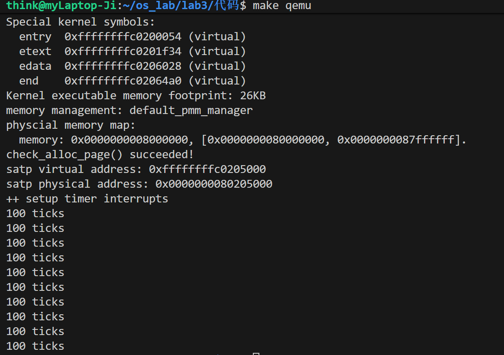

# Lab3实验报告

#### 练习1：完善中断处理 （需要编程）

请编程完善trap.c中的中断处理函数trap，在对时钟中断进行处理的部分填写kern/trap/trap.c函数中处理时钟中断的部分，使操作系统每遇到100次时钟中断后，调用print_ticks子程序，向屏幕上打印一行文字”100 ticks”，在打印完10行后调用sbi.h中的shut_down()函数关机。

要求完成问题1提出的相关函数实现，提交改进后的源代码包（可以编译执行），并在实验报告中简要说明实现过程和定时器中断中断处理的流程。实现要求的部分代码后，运行整个系统，大约每1秒会输出一次”100 ticks”，输出10行。

实验代码如下：

在trap.c文件里面：

```c
static int print_count = 0; 
        case IRQ_S_TIMER:
            /*(1)设置下次时钟中断- clock_set_next_event()
             *(2)计数器（ticks）加一
             *(3)当计数器加到100的时候，我们会输出一个`100ticks`表示我们触发了100次时钟中断，同时打印次数（num）加一
            * (4)判断打印次数，当打印次数为10时，调用<sbi.h>中的关机函数关机
            */
            clock_set_next_event();

            ticks++;

            if (ticks == TICK_NUM) {
                ticks = 0; // 重置 ticks 计数器
                print_ticks(); 
                print_count++; 
            }
            if (print_count == 10) {
                sbi_shutdown(); // 关机
            }
            break;
```

实现过程首先是在 `kern/trap/trap.c` 文件顶部添加了一个静态变量 `static int print_count = 0;` 用来跟踪打印行数。接着，在 `interrupt_handler` 函数的 `case IRQ_S_TIMER:` 分支 中添加了如上代码，首先调用 `clock_set_next_event()` 来设置下一次中断，然后递增定义在 `clock.c` 中的全局 `ticks` 计数器。当 `ticks` 达到100时，它会被重置为0，并调用 `print_ticks()` 和递增 `print_count`；当 `print_count` 达到10次时，系统将调用 `sbi_shutdown()` 关机。

定时器中断的完整处理流程始于内核初始化，此时 `clock_init()` 会开启S模式时钟中断 并调用 `clock_set_next_event()` 来预约第一次中断。当硬件定时器到期触发中断，CPU会根据 `stvec` 寄存器（在 `idt_init` 中设置）的地址跳转到汇编入口 `__alltraps`。汇编代码保存所有CPU寄存器后，调用C函数 `trap()`，后者随即调用 `trap_dispatch()` 来识别中断类型。当中断被识别为时钟中断，`interrupt_handler` 会执行到 `case IRQ_S_TIMER:` 分支。重置下一次中断，增加 `ticks` 计数，并执行打印或关机判断。如果未触发关机，函数将逐层返回，最后通过汇编代码恢复寄存器并执行 `sret` 指令，CPU返回到被中断前的代码继续执行。

`make qemu`运行结果，运行成功



#### 扩展练习 Challenge1：描述与理解中断流程

回答：描述ucore中处理中断异常的流程（从异常的产生开始），其中mov a0，sp的目的是什么？SAVE_ALL中寄寄存器保存在栈中的位置是什么确定的？对于任何中断，__alltraps 中都需要保存所有寄存器吗？请说明理由。

#### 扩增练习 Challenge2：理解上下文切换机制

回答：在trapentry.S中汇编代码 csrw sscratch, sp；csrrw s0, sscratch, x0实现了什么操作，目的是什么？save all里面保存了stval scause这些csr，而在restore all里面却不还原它们？那这样store的意义何在呢？

#### 扩展练习Challenge3：完善异常中断

编程完善在触发一条非法指令异常 mret和，在 kern/trap/trap.c的异常处理函数中捕获，并对其进行处理，简单输出异常类型和异常指令触发地址，即“Illegal instruction caught at 0x(地址)”，“ebreak caught at 0x（地址）”与“Exception type:Illegal instruction"，“Exception type: breakpoint”。