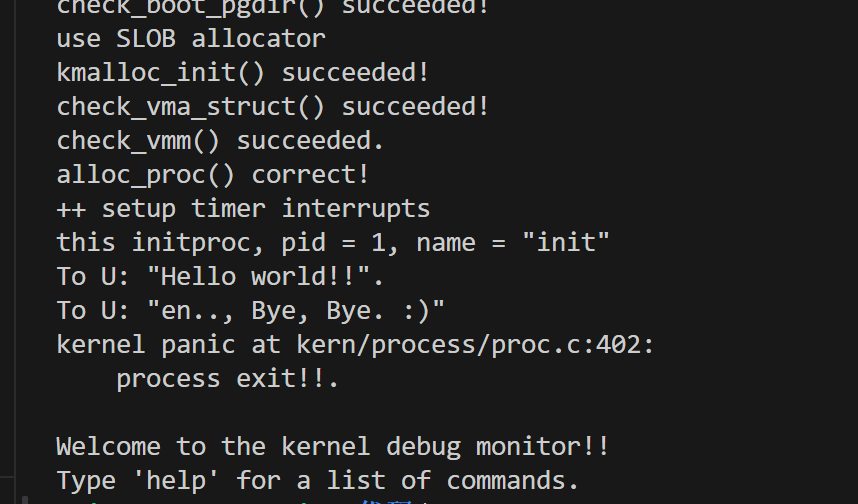
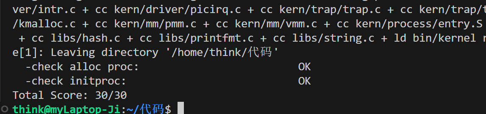

## 练习1：分配并初始化一个进程控制块（需要编码）

alloc_proc函数（位于kern/process/proc.c中）负责分配并返回一个新的struct proc_struct结构，用于存储新建立的内核线程的管理信息。ucore需要对这个结构进行最基本的初始化，你需要完成这个初始化过程。

请在实验报告中简要说明你的设计实现过程。请回答如下问题：

- 请说明proc_struct中`struct context context`和`struct trapframe *tf`成员变量含义和在本实验中的作用是啥？（提示通过看代码和编程调试可以判断出来）

### 1. alloc_proc 的设计与实现过程 ​      
```c++
static struct proc_struct *
alloc_proc(void)
{
    struct proc_struct *proc = kmalloc(sizeof(struct proc_struct));
    if (proc != NULL)
    {
        // 进程状态相关
        proc->state = PROC_UNINIT;     
        proc->pid = -1;                 
        proc->runs = 0;                 
        proc->need_resched = 0;         

        // 栈/地址空间
        proc->kstack = 0;               
        proc->mm = NULL;                
        proc->pgdir = boot_pgdir_pa;    

        // 关系/标志/名字
        proc->parent = NULL;
        proc->flags = 0;
        memset(proc->name, 0, sizeof(proc->name));

        // 上下文与陷入帧
        memset(&proc->context, 0, sizeof(proc->context)); 
        proc->tf = NULL;                          
    }
    return proc;
}
```

`alloc_proc()` 的作用是为新创建的内核线程或进程分配并初始化一个进程控制块（PCB）。

首先使用 `kmalloc` 为 PCB 分配一段连续内核内存，接着初始化进程的基本状态字段：

| 字段名          | 初始化值          | 含义说明                          |
| ------------ | ------------- | ----------------------------- |
| state        | PROC_UNINIT   | 进程处于“未初始化”状态，刚创建尚未准备运行        |
| pid          | -1            | 表示此时还没有正式分配 PID               |
| runs         | 0             | 记录该进程被调度运行的次数，初始为 0           |
| need_resched | 0             | 该进程在创建阶段还不需要立即触发调度。           |
| kstack       | 0             | 内核栈尚未分配，由 setup_stack 在后续完成   |
| mm           | NULL          | 创建的是内核线程，不需要用户态地址空间           |
| pgdir        | boot_pgdir_pa | 使用内核页表，因为所有内核线程共享同一个内核地址空间    |
| parent       | NULL          | 刚创建的内核线程尚无父进程                 |
| flags        | 0             | 进程标志位，创建时清零，后续根据 clone 行为设置   |
| name[]       | 全部清零          | 预留线程名空间，之后用 set_proc_name 来命名 |
| context      | 全部清零          | 保存线程切换时寄存器现场的数据结构，初始为空        |
| tf           | NULL          | 只能放在该线程自己的内核栈中，因此先置为空。        |


### 2. struct context context 

`context` 保存进程在内核态下被切换时的寄存器现场，只包括那些在函数调用约定下必须保存的寄存器（ra、sp、s0~s11）

也就是说：context 用于“内核线程之间的切换”  ，由 `switch_to()` 读写。

在本实验中：当发起调度（schedule）时，当前进程会调用 `switch_to()` 将自己的 context 存入 `proc->context`， 新进程的 context 会被恢复，内核线程就像函数切换一样继续执行。

### 3. struct trapframe _tf_

`trapframe` 保存的是 CPU 从用户态切换到内核态（例如系统调用、异常、中断）时的全部寄存器现场。

包含用户态 PC、 用户态寄存器 x0~x31、 sstatus 等控制寄存器。这些由 RISC-V 硬件陷入异常时自动压栈。

在本实验中：每当进程通过 `fork()` 创建时，会分配新 tf，tf 中构造用户态初值（sp、pc 等），返回用户态时，会根据 `current->tf` 的内容恢复执行现场

| 项目   | context         | trapframe       |
| ---- | --------------- | --------------- |
| 保存位置 | 内核栈             | 用户态 → 内核态陷入时    |
| 保存内容 | 少量寄存器（s寄存器等）    | 全部通用寄存器 + 特殊寄存器 |
| 何时保存 | 调度切换（switch_to） | 硬件陷入异常时（trap）   |
| 何时恢复 | 切换到某个内核线程       | 从内核返回用户态（sret）  |
| 作用   | 内核线程调度          | 中断/异常/系统调用返回    |


   

## 练习2：为新创建的内核线程分配资源（需要编码）

创建一个内核线程需要分配和设置好很多资源。kernel_thread函数通过调用**do_fork**函数完成具体内核线程的创建工作。do_kernel函数会调用alloc_proc函数来分配并初始化一个进程控制块，但alloc_proc只是找到了一小块内存用以记录进程的必要信息，并没有实际分配这些资源。ucore一般通过do_fork实际创建新的内核线程。do_fork的作用是，创建当前内核线程的一个副本，它们的执行上下文、代码、数据都一样，但是存储位置不同。因此，我们**实际需要"fork"的东西就是stack和trapframe**。在这个过程中，需要给新内核线程分配资源，并且复制原进程的状态。你需要完成在kern/process/proc.c中的do_fork函数中的处理过程。它的大致执行步骤包括：

- 调用alloc_proc，首先获得一块用户信息块。
- 为进程分配一个内核栈。
- 复制原进程的内存管理信息到新进程（但内核线程不必做此事）
- 复制原进程上下文到新进程
- 将新进程添加到进程列表
- 唤醒新进程
- 返回新进程号

请在实验报告中简要说明你的设计实现过程。请回答如下问题：

- 请说明ucore是否做到给每个新fork的线程一个唯一的id？请说明你的分析和理由。

#### 设计与实现过程概述
系统首先调用 alloc_proc 为新进程分配并初始化一个进程控制块 proc_struct，其中包含进程状态、上下文、父进程指针等必要信息。随后，setup_kstack 为新进程分配独立的内核栈空间，用于保存运行时的内核态数据。接着，copy_mm 根据 clone_flags 参数决定是与父进程共享内存空间（线程）还是复制一份独立的地址空间（进程）。在完成内存环境的设置后，copy_thread 会建立子进程的内核上下文和陷入帧，使得新进程能够从正确的执行点开始运行。进程的唯一标识符 pid 由 get_pid() 函数生成，它通过静态自增和全局链表查重机制保证系统中每个活跃进程的 id 唯一。最后，系统将新建的进程插入进程哈希表和全局进程链表，并调用 wakeup_proc 将其状态设置为可运行。通过这一系列步骤，ucore 实现了从进程控制块分配、内核栈设置、上下文建立到唯一标识符分配的完整 fork 流程，从而确保新进程能被内核正确调度和管理。
下面是代码分析：

检查系统进程数量限制
```c++
if (nr_process >= MAX_PROCESS)
    goto fork_out;
```

这一步确保系统中进程数量不会超过内核支持的最大值 MAX_PROCESS。若达到上限则直接返回错误码 -E_NO_FREE_PROC。

分配进程控制块（PCB）
```c++
proc = alloc_proc();
```
调用 alloc_proc() 分配 proc_struct 结构体，用于记录新进程的状态信息，包括栈指针、页表指针、寄存器上下文等。若分配失败，直接跳转到清理阶段。

为进程分配内核栈
```c++
setup_kstack(proc);
```

调用 setup_kstack() 为新进程分配内核栈空间（KSTACKPAGE 页），供内核态运行时使用。若失败则回收已分配的 proc 结构。

复制或共享内存空间
```c++
copy_mm(clone_flags, proc);
```

根据 clone_flags 决定是否与父进程共享地址空间。
若设置了 CLONE_VM，新线程共享父进程内存空间；
否则为新进程分配独立的虚拟内存（普通进程）。
由于本实验仅涉及内核线程，因此函数在当前阶段不执行实际复制操作。

建立内核上下文与陷入帧
```c++
copy_thread(proc, stack, tf);
```

该函数设置新进程的栈顶指针、保存的寄存器状态（trapframe）及返回地址。
trapframe 中 epc 代表进程恢复执行的入口点，context 用于进程切换时保存 CPU 上下文。

分配唯一的进程号（PID）
```c++
proc->pid = get_pid();
```

get_pid() 通过静态自增和全局查重机制生成唯一 PID，确保系统中不会出现重复 ID。

将进程插入调度队列
```c++
hash_proc(proc);
list_add(&proc_list, &(proc->list_link));
```

新进程被加入到哈希表与全局链表中，方便调度器管理与查找。

唤醒新进程并返回 PID
```c++
wakeup_proc(proc);
nr_process++;
ret = proc->pid;
```

设置进程状态为 PROC_RUNNABLE，表示可被调度执行。
最终返回新进程的 PID。

错误处理机制

若任意步骤失败，代码会通过带标签的 goto 语句跳转到相应清理逻辑,这种结构可确保内核在分配失败时不会造成内存泄漏或悬挂指针。
```c++
bad_fork_cleanup_kstack:
    put_kstack(proc);
bad_fork_cleanup_proc:
    kfree(proc);
```


#### 唯一性说明
ucore 为每个新创建的进程分配一个唯一的进程标识符 pid，其唯一性由 get_pid() 函数保证。该函数内部维护静态变量 last_pid，每次调用时会自增以生成新的 pid。当 last_pid 达到上限 MAX_PID 时会从 1 重新开始分配。函数会遍历系统的全局进程链表 proc_list，检测当前候选 pid 是否已被占用，若重复则继续递增直到找到未使用的 pid。因此，在任意时刻，系统中每个活动进程都拥有唯一的 pid。当进程结束并被父进程回收后，其 pid 才会被释放并可能被再次使用。综上，ucore 通过静态自增与全局查重机制实现了对每个 fork 创建的新线程分配唯一 id 的设计，从而保证了内核调度与进程管理的一致性和正确性。

## 练习3：编写proc_run 函数（需要编码）

proc_run用于将指定的进程切换到CPU上运行。它的大致执行步骤包括：

- 检查要切换的进程是否与当前正在运行的进程相同，如果相同则不需要切换。
- 禁用中断。你可以使用`/kern/sync/sync.h`中定义好的宏`local_intr_save(x)`和`local_intr_restore(x)`来实现关、开中断。
- 切换当前进程为要运行的进程。
- 切换页表，以便使用新进程的地址空间。`/libs/riscv.h`中提供了`lsatp(unsigned int pgdir)`函数，可实现修改SATP寄存器值的功能。
- 实现上下文切换。`/kern/process`中已经预先编写好了`switch.S`，其中定义了`switch_to()`函数。可实现两个进程的context切换。
- 允许中断。

请回答如下问题：

- 在本实验的执行过程中，创建且运行了几个内核线程？

完成代码编写后，编译并运行代码：make qemu

实现代码如下：
```C
void proc_run(struct proc_struct *proc)
{
    if (proc != current)
    {
        // LAB4:2311786
        // 1. 保存当前的中断状态，并关闭中断。
        bool intr_flag;
        local_intr_save(intr_flag);
        
        // 2. 准备切换。
        struct proc_struct *prev = current;
        current = proc;

        // 3. 切换页表（切换地址空间）。
        lsatp(current->pgdir);

        // 4. 切换CPU上下文（切换寄存器和执行流）
        switch_to(&(prev->context), &(current->context));

        // 5. 恢复中断状态。
        local_intr_restore(intr_flag);

    }
}
```
首先需要关闭中断，因为如果不关中断，假设 CPU 刚切换了页表 (lsatp) 但还没切换栈 (switch_to)，此时若发生中断，中断处理程序会使用新页表但旧栈，这会导致严重的内存访问错误；之后更新当前的进程指针；之后使用lsatp 指令更新 satp 寄存器，使 CPU 开始使用新进程的页表；最后保存 prev 进程的寄存器到 prev->context，并从 current->context 加载新进程的寄存器。这样当 switch_to 的 ret 指令执行时，CPU 的 ra（返回地址）寄存器已经被换成了新进程的值（通常是 forkret），于是 CPU 跳转到新进程的代码开始执行。

在本实验的执行过程中，创建且运行了2个内核线程：
第一个，idleproc (PID 0)：

系统启动时，由 proc_init 函数手动构造（调用 alloc_proc 并直接赋值）。它是系统的第 0 个进程。当 OS 初始化完成后，执行流进入 cpu_idle 函数的死循环，此时运行的就是 idleproc。它的主要工作是查询是否有其他就绪进程，并进行调度。它是一个只有内核态的“空闲进程”，永远不会退出。

第二个，initproc (PID 1)：

由 idleproc 在 proc_init 中调用 kernel_thread -> do_fork 创建。：idleproc 执行 schedule() 时，发现了状态为 PROC_RUNNABLE 的 initproc，于是调用 proc_run 切换到它。initproc 随后执行 init_main 函数，打印 "Hello World"。它执行完 init_main 后会调用 do_exit，最终成为僵尸进程 (PROC_ZOMBIE)。

`make qemu`结果如下：


且`make grade`结果如下：


可以见得我们的代码编写成功！

## 扩展练习 Challenge：

### 1. 说明语句`local_intr_save(intr_flag);....local_intr_restore(intr_flag);`是如何实现开关中断的？

这两个宏位于 `sync.h`:

`local_intr_save(intr_flag)`的作用是在临界区开始前关闭中断，防止被硬件中断打断，确保原子性。

```c++
static inline bool __intr_save(void) {
    if (read_csr(sstatus) & SSTATUS_SIE) {
        intr_disable();
        return 1;
    }
    return 0;
}

#define local_intr_save(x) \
    do {                   \
        x = __intr_save(); \
    } while (0)
```
在进入临界区之前，`local_intr_save(intr_flag)` 会读取当前 `sstatus` 寄存器中的中断使能位（SIE），通过 `__intr_save()` 判断中断是否处于开启状态；若 SIE 置位，则调用 `intr_disable()` 清除该位，从而关闭中断，并返回 1 表示“原本中断是打开的”；若 SIE 本来就是 0，则直接返回 0。这个返回值被保存到 `intr_flag` 中，用于准确记录进入临界区前中断的原始状态。

`local_intr_restore(intr_flag)`的作用是恢复进入临界区之前的中断状态。
```c++
static inline void __intr_restore(bool flag) {
    if (flag) {
        intr_enable();
    }
}

#define local_intr_restore(x) __intr_restore(x);
```
离开临界区时，`local_intr_restore(intr_flag)` 会调用 `__intr_restore(flag)`：若 `flag == 1`，则说明中断原本是开启的，需要调用 `intr_enable()` 恢复 SIE 位；若 `flag == 0`，则保持中断关闭状态不变。

通过这种方式，内核可以在临界区中安全地关闭中断，同时保证退出临界区后恢复到正确的中断状态


### 2. 深入理解不同分页模式的工作原理（思考题）

   get_pte()函数（位于`kern/mm/pmm.c`）用于在页表中查找或创建页表项，从而实现对指定线性地址对应的物理页的访问和映射操作。这在操作系统中的分页机制下，是实现虚拟内存与物理内存之间映射关系非常重要的内容。

   - get_pte()函数中有两段形式类似的代码， 结合sv32，sv39，sv48的异同，解释这两段代码为什么如此相像。
   - 目前get_pte()函数将页表项的查找和页表项的分配合并在一个函数里，你认为这种写法好吗？有没有必要把两个功能拆开？
  
```c++
pte_t *get_pte(pde_t *pgdir, uintptr_t la, bool create)
{
    pde_t *pdep1 = &pgdir[PDX1(la)];
    if (!(*pdep1 & PTE_V))
    {
        struct Page *page;
        if (!create || (page = alloc_page()) == NULL)
        {
            return NULL;
        }
        set_page_ref(page, 1);
        uintptr_t pa = page2pa(page);
        memset(KADDR(pa), 0, PGSIZE);
        *pdep1 = pte_create(page2ppn(page), PTE_U | PTE_V);
    }
    pde_t *pdep0 = &((pte_t *)KADDR(PDE_ADDR(*pdep1)))[PDX0(la)];
    if (!(*pdep0 & PTE_V))
    {
        struct Page *page;
        if (!create || (page = alloc_page()) == NULL)
        {
            return NULL;
        }
        set_page_ref(page, 1);
        uintptr_t pa = page2pa(page);
        memset(KADDR(pa), 0, PGSIZE);
        *pdep0 = pte_create(page2ppn(page), PTE_U | PTE_V);
    }
    return &((pte_t *)KADDR(PDE_ADDR(*pdep0)))[PTX(la)];
}
```
 
#### 问题一：
 
 get_pte() 的核心任务是： 逐级遍历多级页表，如果中间页表不存在并且 create=1，就分配新的中间页表；如果存在则进入下一层，直到找到最终的 PTE。


`pdep1`对应页表的 **第一级目录项**，`pdep0`：对应页表的 **第二级目录项**。可以看到，两段代码都执行相同操作：

1. 判断该级页表项是否有效（PTE_V）
2. 若无效且 `create==true` → 为这一层分配一个新的页表页
3. 清零页表页
4. 设置新的 PTE，将下一层页表连接起来

这是因为 在 RISC-V 的 SV32、SV39 和 SV48 分页机制中，页表都采用多级结构：每一级都由页表项数组组成，指向下一层页表。

|模式|层级数|每级大小|
|---|---|---|
|SV32|2 级|10/10/12|
|SV39|3 级|9/9/9/12|
|SV48|4 级|9/9/9/9/12|

由于每一级页表执行的操作完全相同——判断是否存在、必要时分配新页表页、清零并标记有效——因此 `get_pte()` 在遍历不同页表层级时必须重复相同的逻辑。

#### 问题二：

我觉得没有必要拆开：

目前 `get_pte()` 把页表项的查找与必要的中间页表分配整合在同一个函数里，我觉得这样做的核心优势是能减少代码重复，接口使用起来也更便捷 —— 尤其契合 uCore 中频繁需要 “找不到就创建” 的场景，比如 `page_insert` 功能的实现。

从抽象设计的角度来说，把查找和创建拆分成两个独立函数：一个仅负责查找、一个负责查找并分配，确实能让语义划分更清晰。但对 uCore 这样层级较少、功能偏简化的教学系统而言，我认为拆分的实际收益并不突出，反而会额外增加代码的复杂度。


## 知识点总结
虚拟内存与分页的核心作用是将程序看到的线性地址空间与物理内存解耦。CPU 产生的虚拟地址通过页表映射到物理页帧，操作系统维护页表，MMU 与 TLB 负责加速转换。这样可以提供三方面能力：

访问隔离与保护：通过 PTE 的权限位控制读、写、执行；

扩大可用地址空间：程序可使用比物理内存更大的虚拟空间；

按需分配与共享：首次访问时分配物理页；文件映射可实现多个进程共享内存。

缺点在于缺页异常与换页带来的高延迟，频繁换页会导致系统抖动。

以 RISC-V 的 sv39 为例，39 位虚拟地址分为 VPN[2]/VPN[1]/VPN[0] 和 12 位页内偏移；物理地址由 PPN[2]/PPN[1]/PPN[0] 与同样的偏移组成。sv39 使用三级页表，最高层通常称为页目录。页表项（PTE）包含物理页号 PPN 和控制位（如 V/R/W/X/U/A/D/G 等），既用于恢复物理地址，也用于权限控制与置换策略。实现中依赖的一组宏（例如 PDX1/PDX0/PTX/PGOFF、PGADDR、PTE_ADDR）负责从线性地址提取索引或从 PTE 恢复物理地址，使内核能通过 KADDR 访问页表页。

多级页表的实现关键是逐级查找与按需创建。get_pte 用于找到某个虚拟地址对应的最终 PTE：从 pgdir 的 PDX1 获取第一级 PDE，如果无效且允许创建，则分配新页作为下一级页表、清零、并写入 PDE（通常带 PTE_U|PTE_V）。继续在第二级和第三级查找，直到返回 PTX 所对应的 pte_t 指针。实现中需要正确处理物理地址与内核虚拟地址的转换（page2pa / KADDR），同时要确保新分配的页表被完全清零，避免遗留脏数据。多级页表降低了稀疏地址空间的内存开销，但增加了查表开销，因此 TLB 和大页是典型的性能优化手段。

建立与删除映射时，应保证原子性和引用计数的正确维护。page_insert 的步骤包括：通过 get_pte 获取（必要时创建）PTE 指针；为目标物理页增加引用计数；如果当前 PTE 有效且指向不同页，则调用 page_remove_pte 减少旧页引用并在需要时释放；然后写入新的 PTE（由 pte_create(page2ppn(page), PTE_V|perm) 构造），最后调用 tlb_invalidate 刷新 TLB。page_remove_pte 则在清除映射时检查 PTE_V，找到对应 Page 做引用计数减一、在为零时释放物理页，然后把 PTE 清零并刷新 TLB。实现时要保证 PTE 写入与 TLB 刷新顺序正确，并在可能的并发或中断环境中确保其原子性（通常通过禁中断或加锁实现）。

内核镜像的不同段（.text/.rodata/.data/.bss）如果在早期用一个大页统一映射，会导致权限不正确（例如允许写 .text）。正确方式是对各段逐页建立 PTE，设置精确的 R/W/X/U 权限。常见方法是构造一张新的完整页表，在其中按段建立精细映射，再通过更新 satp 原子切换到新页表，并刷新 TLB，最后回收旧的大页映射。

进程控制块（proc_struct）汇总了一个进程/线程的全部元数据：进程状态（UNINIT/RUNNABLE/SLEEPING/ZOMBIE）、PID、内核栈 kstack、调度标志 need_resched、父进程 parent、内存管理结构 mm（描述地址空间与页表根），以及两种不同的寄存器保存结构——context 和 trapframe。context 保存被调用者保存寄存器（ra、sp、s0–s11），用于 switch_to 切换时恢复；trapframe 保存用户态进入内核时的完整寄存器状态，用于系统调用和中断返回。区分二者很重要：context 仅用于调度切换，而 trapframe 反映用户态现场，内核可修改它（如 a0、epc）以控制系统调用返回值和下一条执行指令。

内核线程的创建流程从 kernel_thread 开始：构造一个局部 trapframe，设置要运行的函数地址（s0）和参数（s1），配置 sstatus（设置 SPP/SPIE、清除 SIE），并将 epc 指向 kernel_thread_entry，然后调用 do_fork。do_fork 负责 alloc_proc、分配内核栈、按照 clone_flags 决定是否复制或共享 mm（内核线程通常共享内核地址空间），调用 copy_thread 在新栈上复制 trapframe、设置 context（ra 为 forkret，sp 为 trapframe），再将新进程加入调度队列并置为 RUNNABLE。初次调度到新线程时，forkret 与 forkrets 会切换到它的 trapframe 并进入 __trapret，从而恢复完整寄存器现场并开始执行 kernel_thread_entry 指向的代码。

调度与上下文切换由 cpu_idle、schedule、proc_run 与 switch_to 组成。cpu_idle 在空转时检查 need_resched，若需调度则调用 schedule；schedule 清除 need_resched，从 proc_list 中按策略选择下一个 RUNNABLE 进程，随后调用 proc_run。proc_run 切换 satp 到新进程的 pgdir，然后调用 switch_to 实现寄存器切换。switch_to 的汇编代码只保存/恢复被调用者保存寄存器，使得切换开销最小；返回时进入 forkret，然后通过 forkrets/__trapret 从 trapframe 恢复剩余寄存器并回到正常执行流程。
  
- 基本原理概述：虚拟内存是操作系统为程序提供的逻辑地址空间，CPU/程序看到的地址由页表映射到物理内存，借此实现地址隔离、访问保护和内存扩展。分页将逻辑地址拆为页号与页内偏移，MMU/页表完成 VPN→PFN 的转换，TLB 缓存常用映射以提升性能；按需分页可延迟分配物理帧以节省内存，换页（swap）把冷页写入磁盘以扩大可用逻辑内存，但会带来高延迟和抖动风险。
  
- 页表项设计思路：页表项（PTE）既承载物理页号（PPN）也承载权限与状态位，常见字段包括有效位（V）、读/写/执行位（R/W/X）、用户位（U）、访问/脏位（A/D）及全局位等；设计要点是把地址与标志清晰分离、保证对齐并能高效提取/组装（如 PDX/PTX/PGOFF、PGADDR、PTE_ADDR 等宏），同时利用 A/D 等位支持高效置换策略和写回优化，并通过严格权限位实现内核与用户态、只读段与可写段的安全隔离。
使用多级页表实现虚拟存储：以 RISC-V sv39 为例采用三级页表，地址逐级查找 VPN[2]→VPN[1]→VPN[0] 得到最终 PTE；实现上 get_pte 支持按需分配页表页并清零，page_insert/page_remove 负责建立/撤销映射并维护物理页引用计数，page_remove_pte 在撤销时处理引用递减与可能的物理页释放，所有页表修改后须调用 tlb_invalidate 保持一致性；对于需要细粒度权限的段（如 .text/.rodata/.data/.bss），常需放弃粗糙大页、重建精细页表并切换 satp 来完成重映射。

- 内核线程管理：内核线程在内核虚拟空间运行、通常共享内核页表，无需独立地址空间；创建流程由 kernel_thread 构造初始 trapframe（将目标函数与参数放入寄存器、设置 sstatus 与 epc 指向内核入口）并调用 do_fork，do_fork 负责分配 PCB 与内核栈、设置上下文与 trapframe（由 copy_thread 完成），使新线程在被调度时可从 kernel_thread_entry 恢复并执行指定函数，线程执行完毕后通过 do_exit 回收。
  
- 设计关键数据结构：proc_struct 包含进程生命周期与运行所需的所有元信息——状态（PROC_UNINIT/RUNNABLE/SLEEPING/ZOMBIE）、PID、内核栈地址 kstack、调度标志 need_resched、父进程 parent、内存管理指针 mm、上下文 context（保存 callee-saved 寄存器以供 switch）、trapframe tf（保存用户态陷入内核时完整寄存器现场）、页表根 pgdir、标志与名字，以及用于全局管理的链表/哈希链结点；这些字段使得调度、地址空间切换、系统调用返回与资源回收都可被正确实施，并通过全局结构（current、initproc、proc_list、hash_list）实现进程的查找与调度管理。
