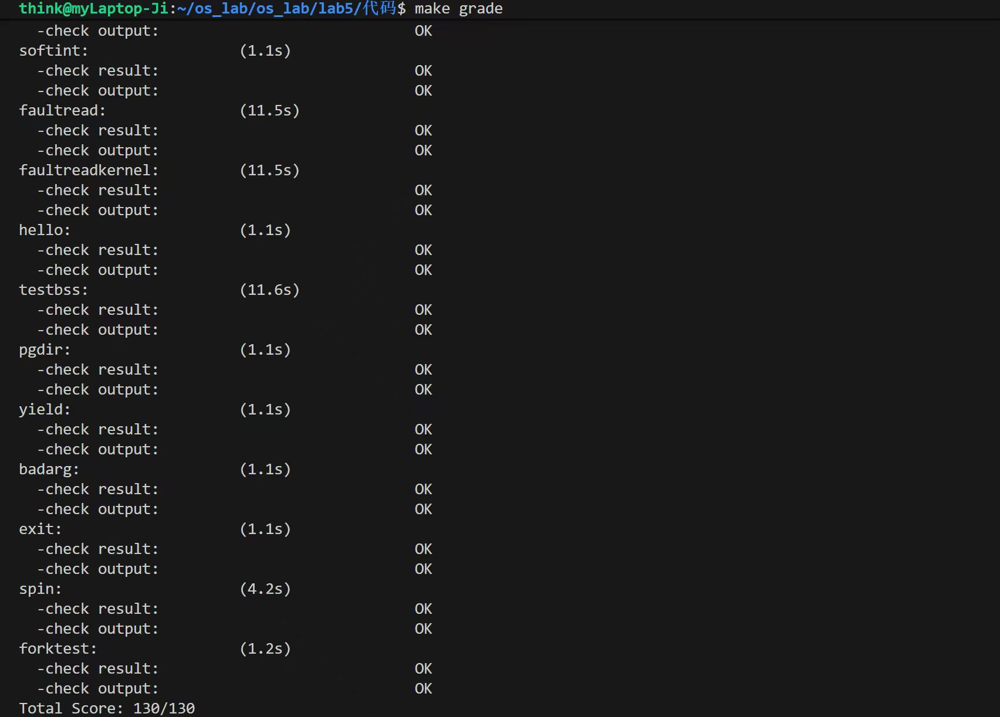
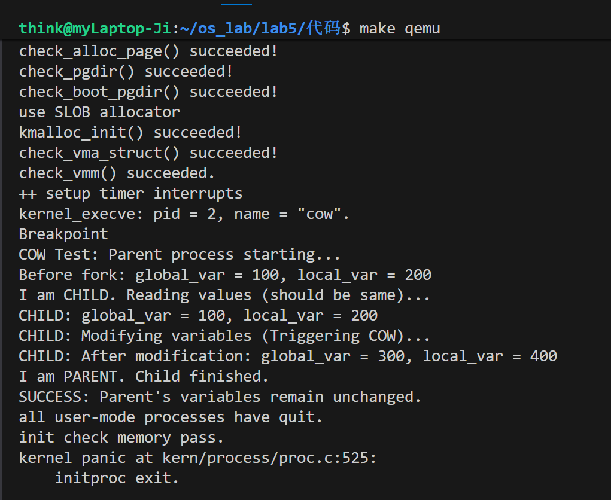

# 用户程序实验报告
## 练习1: 加载应用程序并执行（需要编码）
do_execv函数调用load_icode（位于kern/process/proc.c中）来加载并解析一个处于内存中的ELF执行文件格式的应用程序。你需要补充load_icode的第6步，建立相应的用户内存空间来放置应用程序的代码段、数据段等，且要设置好proc_struct结构中的成员变量trapframe中的内容，确保在执行此进程后，能够从应用程序设定的起始执行地址开始执行。需设置正确的trapframe内容。

请在实验报告中简要说明你的设计实现过程。

请简要描述这个用户态进程被ucore选择占用CPU执行（RUNNING态）到具体执行应用程序第一条指令的整个经过。


### 1. 设计实现过程

在 `load_icode` 函数中，我们在完成了建立虚拟内存空间、加载 ELF 二进制文件之后，需要设置进程的**中断帧（Trapframe）**，以便内核在执行中断返回（`sret`）指令时，能够正确地切换到用户态并开始执行应用程序。

我的具体设计实现如下：

1.  **设置用户栈指针 (`tf->gpr.sp`)**：
    将中断帧中的栈指针寄存器 `sp` 设置为 `USTACKTOP`。这是因为在前面的步骤中，我们已经映射了用户栈的虚拟地址空间，此处需要确保用户程序在开始执行时，栈指针指向正确的用户栈顶位置。

2.  **设置入口地址 (`tf->epc`)**：
    将中断帧中的异常程序计数器 `epc` 设置为 ELF header 中读取到的 `e_entry`。当执行 `sret` 指令时，硬件会将 PC 跳转到 `sepc` 寄存器（即此处的 `epc`）指向的地址，从而进入应用程序的第一条指令。

3.  **设置处理器状态 (`tf->status`)**：
    为了确保进程在用户模式下运行且能够响应中断，需要修改 `sstatus` 寄存器的对应位：
    * **清除 `SSTATUS_SPP` 位**：将 SPP（Supervisor Previous Privilege）位清零，确保执行 `sret` 后 CPU 处于 User Mode（用户态）。
    * **置位 `SSTATUS_SPIE` 位**：将 SPIE（Supervisor Previous Interrupt Enable）位置 1，确保进入用户态后，中断是被允许的（即恢复之前的中断使能状态）。


补充代码如下：
```C
     // 1. 设置用户栈指针 (sp)
    tf->gpr.sp = USTACKTOP;

    // 2. 设置异常程序计数器 (epc)
    tf->epc = elf->e_entry;

    // 3. 设置状态寄存器 (status/sstatus)
    // SSTATUS_SPP (Supervisor Previous Privilege): 设为 0，代表中断返回后处于 User Mode
    // SSTATUS_SPIE (Supervisor Previous Interrupt Enable): 设为 1，代表中断返回后开启中断
    tf->status = read_csr(sstatus);
    tf->status &= ~SSTATUS_SPP; // 确保返回后是用户态 (SPP=0)
    tf->status |= SSTATUS_SPIE; // 确保返回后中断是使能的 (SPIE=1)
```


### 2. 详细执行流程描述

当该用户态进程被 uCore 调度器选择占用 CPU（从 `PROC_RUNNABLE` 态转变为 `PROC_RUNNING` 态），直到执行应用程序第一条指令，经历了以下过程：

1.  **调度与切换 (`schedule` -> `proc_run`)**：
    内核调度器调用 `schedule` 函数，选中该进程，并调用 `proc_run`。`proc_run` 内部通过 `lsatp` 切换页表（切换到该进程的地址空间），然后调用汇编函数 `switch_to`。

2.  **上下文恢复 (`switch_to`)**：
    `switch_to` 保存当前进程的上下文，并加载新进程的 `proc_struct->context`（内核上下文）。由于这是一个新创建的进程，其上下文中的 `ra`（返回地址）此前在 `copy_thread` 中被设置为了 `forkret` 函数的入口。

3.  **内核线程入口 (`forkret`)**：
    `switch_to` 返回后，CPU 跳转到 `forkret` 函数。该函数通过 `current->tf` 获取当前进程的中断帧，并调用 `forkrets(current->tf)`。

4.  **准备中断返回 (`forkrets` -> `__trapret`)**：
    `forkrets` 会接收中断帧指针，并跳转到 `trapentry.S` 中的 `__trapret` 标号处。

5.  **恢复硬件上下文 (`RESTORE_ALL`)**：
    在 `__trapret` 中，执行一系列 `LOAD` 指令，将 `current->tf`（中断帧）中保存的数据恢复到 CPU 的通用寄存器中。此时：
    * `sp` 寄存器被恢复为 `USTACKTOP`（用户栈）。
    * 其他通用寄存器被清零或恢复。
    * `sepc` 寄存器被恢复为 ELF 的入口地址。

6.  **特权级切换 (`sret`)**：
    最后执行 `sret` 指令。CPU 依据 `sstatus` 中的 `SPP` 位（已设为 0）将特权级从 Supervisor Mode 切换到 **User Mode**，同时将 PC 跳转到 `sepc` 中的地址。

7.  **执行第一条指令**：
    此时 CPU 处于用户态，PC 指向应用程序入口，开始执行应用程序的第一条指令。

## 练习2: 父进程复制自己的内存空间给子进程（需要编码）
**创建子进程的函数do_fork在执行中将拷贝当前进程（即父进程）的用户内存地址空间中的合法内容到新进程中（子进程），完成内存资源的复制。具体是通过copy_range函数（位于kern/mm/pmm.c中）实现的，请补充copy_range的实现，确保能够正确执行。**

**请在实验报告中简要说明你的设计实现过程。**

**如何设计实现Copy on Write机制？给出概要设计，鼓励给出详细设计。**

### 1.copy_range函数实现

```c
            void *src_kvaddr = page2kva(page);
            void *dst_kvaddr = page2kva(npage);
            memcpy(dst_kvaddr, src_kvaddr, PGSIZE);
            ret = page_insert(to, npage, start, perm);
```

在 `copy_range` 函数中，按**页大小**对父进程的用户虚拟地址空间进行复制。

对于每一个需要复制的用户页，首先为子进程**新分配一个物理页**。随后通过 `page2kva` 将父进程对应的物理页以及新分配的物理页转换为内核虚拟地址，使内核可以直接访问这两块内存。

接着使用 `memcpy` 将父进程页面中的内容完整拷贝到子进程的新页面中，最后调用 `page_insert`，在子进程页表中建立虚拟地址到该物理页的映射，并沿用父进程的访问权限。

### 2.Copy on Write机制设计


Copy on Write 是一种**延迟内存复制**的机制，其核心思想是：**在进程创建时不立即复制物理页面，而是在发生写操作时才进行复制**。通过该机制，可以显著减少不必要的内存拷贝，提高系统性能和内存利用率。

接下来我将给出详细设计过程：

#### 1. fork 阶段

在本实验中，我们需要在 `do_fork / copy_range` 阶段引入 Copy on Write 机制，不再为子进程立即分配新的物理页并复制内容，而是采用**共享映射**的方式完成地址空间的建立。

具体而言，我需要让父进程和子进程的页表项同时指向同一个物理页，并清除页表项中的写权限位，同时设置软件定义的 `PTE_COW` 标志位，用于标识该页面为写时复制页面。

此外，我还需要对该物理页的引用计数进行增加，以准确反映其被多个进程共享的状态。


#### 2. 页表项与权限设计

为了支持写时复制机制，我还需要对参与 COW 的页表项进行了统一的权限设计。每个 COW 页面对应的页表项均满足以下特征：页面有效（`PTE_V`）、允许用户态访问（`PTE_U`），但不包含写权限位（`PTE_W`），并额外设置 `PTE_COW` 标志。

#### 3. 写时触发

在进程运行过程中，当某个进程尝试对 COW 页面进行写访问时，由于该页面在页表中被标记为只读，CPU 会自动触发页保护异常并进入内核态。此时，我们在 Page Fault 处理函数中对异常原因进行判断，确认其为写访问导致的异常，并进一步检查对应页表项是否被标记为 `PTE_COW`。

只有在上述条件均满足的情况下，系统才会执行写时复制流程，从而保证普通只读页和非法访问不会被误处理为 COW 情况。

#### 4.真正复制页面

在 Page Fault 处理函数中，我需要根据物理页的共享情况采取不同的处理策略。首先获取当前页表项所指向的原物理页 `old_page`，并检查其引用计数。

当引用计数大于 1 时，说明该页面仍被多个进程共享。此时，我们为当前进程分配新的物理页 `new_page`，并将 `old_page` 中的内容完整复制到 `new_page`。随后更新当前进程的页表项，使其指向新分配的物理页，并恢复写权限，同时清除 `PTE_COW` 标志；原物理页的引用计数相应减一。

当引用计数等于 1 时，说明该页面已经不再被其他进程共享。我们无需再进行页面复制，只需直接为该页恢复写权限并清除 `PTE_COW` 标志即可。最后，我们刷新 TLB，以确保页表修改能够立即生效。

#### 5. 页面释放与回收

在进程退出或解除地址空间映射时，我还需要对相关物理页的引用计数进行递减。当某个物理页的引用计数降为 0 时，系统将其回收并释放对应的物理内存。


## 练习3: 阅读分析源代码，理解进程执行 fork/exec/wait/exit 的实现，以及系统调用的实现（不需要编码）
请在实验报告中简要说明你对 fork/exec/wait/exit函数的分析。并回答如下问题：

- 请分析fork/exec/wait/exit的执行流程。重点关注哪些操作是在用户态完成，哪些是在内核态完成？内核态与用户态程序是如何交错执行的？内核态执行结果是如何返回给用户程序的？
- 请给出ucore中一个用户态进程的执行状态生命周期图（包执行状态，执行状态之间的变换关系，以及产生变换的事件或函数调用）。（字符方式画即可）
执行：make grade。如果所显示的应用程序检测都输出ok，则基本正确。（使用的是qemu-1.0.1）

在本实验中，fork/exec/wait/exit 这几个系统调用的共同模式是：用户态通过库函数发起系统调用，利用 ecall 指令触发陷入，CPU 进入内核态后，在 trap 处理函数中根据系统调用号分发到对应的内核实现（sys_fork/sys_exec/sys_wait/sys_exit），这些函数再调用 do_fork/do_execve/do_wait/do_exit 完成实际的进程管理工作，最后由内核修改当前进程的 trapframe（特别是保存返回值的寄存器和返回地址 epc），通过 sret 返回到用户态。从用户程序视角看，它只是调用了一个普通的 C 函数，获得一个返回值；但在这期间，CPU 实际在用户态和内核态之间完成了一次完整的上下文切换和资源操作。以 fork 为例，用户态调用库函数 fork（或者 sys_fork），在 user/libs/syscall.c 中统一通过 syscall() 把系统调用号装入寄存器 a0，参数装入 a1 等，然后执行一条 ecall。这一步是纯用户态的工作。ecall 执行后，硬件把用户态的 pc 保存到 sepc，记录陷入原因到 scause，切到内核栈并跳转到 trap 入口。汇编入口代码把所有通用寄存器保存到当前进程的内核栈上，形成 struct trapframe，然后调用 C 函数 trap(struct trapframe *tf)。在 trap 中，根据 tf->cause 判断是用户态系统调用（CAUSE_USER_ECALL），把 tf->epc 加 4（跳过 ecall 指令本身），再调用 syscall()。syscall() 从 tf->gpr.a0 里取出系统调用号，从 a1~a5 中取出参数，查系统调用表，调到 sys_fork，由它继续调用 do_fork。do_fork 在内核态完成：分配子进程的 proc_struct，分配子进程内核栈，复制或共享父进程的地址空间（创建新的 mm 和页表，复制父进程的页表项和物理页映射），设置父子关系和新的 pid，把子进程插入到全局进程链表和就绪队列中，构造子进程的线程上下文和 trapframe，使得子进程第一次被调度执行时，从 fork 调用之后的用户态指令开始执行，并且在子进程的 trapframe 中将 a0 设为 0。do_fork 自身返回的是子进程 pid，内核把这个返回值写回当前进程的 trapframe 中的 a0。之后 trap 收尾，汇编部分从 trapframe 中恢复寄存器，执行 sret 回到用户态。这样父进程在用户态看到 fork() 返回子进程 pid，而子进程在第一次被调度时，从同一条 fork 调用之后的指令开始执行，看到的返回值为 0。这说明内核态的执行结果是通过修改 trapframe 中寄存器的值（尤其是返回值寄存器和 epc）返回给用户程序的。

exit 的执行流程与之类似，但方向相反。用户态调用 exit(code) 后，通过 ecall 进入内核，进入 sys_exit，再调用 do_exit(code)。在 do_exit 中，首先会防御性地检查不能退出某些特殊进程，随后切换到内核页表，释放当前进程的用户态地址空间，包括销毁 mm、取消页表映射等，然后把当前进程的状态设为 PROC_ZOMBIE，记录退出码 exit_code，必要时调整子进程的父指针（例如交给 init），并唤醒正在等待该进程的父进程。最后调用 schedule() 切换走，do_exit 不再返回到用户态。也就是说，调用 exit 的进程在内核中完成清理之后，其生命周期从运行态转入僵尸态，之后只有父进程通过 wait 调用来回收它，调用 exit 的那一段用户代码不会再继续执行。

wait 的主要作用是让父进程在内核中等待子进程结束并回收子进程资源。用户态调用 wait(&code)，通过 ecall 进入内核，系统调用分发后进入 do_wait(pid, code_store)。在 do_wait 中，内核先利用 user_mem_check 等机制检查 code_store 是否是合法的用户空间地址，然后遍历进程表，寻找以当前进程为父进程的子进程。如果找到一个状态为 PROC_ZOMBIE 的子进程，就把该子进程的 exit_code 写入到用户传入的 code_store 指向的内存中，释放该子进程的内核栈和 PCB，把它从进程链表中移除，最后返回该子进程的 pid。如果发现有子进程存在，但它们尚未退出，则当前进程会把自己的状态设为 PROC_SLEEPING，设置等待原因（例如等待子进程结束），然后调用 schedule() 主动放弃 CPU，直到将来被唤醒。子进程在 do_exit 中设置自身为 PROC_ZOMBIE 后，会调用 wakeup_proc(parent) 唤醒父进程，父进程再次被调度回来继续执行 do_wait 中的循环，直至找到僵尸状态的子进程并完成回收。最后，do_wait 返回子进程 pid，syscall() 将该 pid 写入 trapframe 的 a0，sret 返回用户态，用户进程中的 wait() 函数就以这个值作为返回结果。

exec 是在当前进程内部替换用户态程序的系统调用。用户态调用 exec 后进入内核，经过系统调用分发进入 do_execve(name, len, binary, size)。在 do_execve 中，内核首先检查程序名和参数字符串的用户地址合法性，然后释放当前进程原有的用户地址空间和页表，创建新的 mm，解析 ELF 格式的可执行文件，根据程序头为各个段分配物理页，并建立新的页表映射，拷贝代码和数据段到新地址空间，设置新的用户栈。随后修改当前进程 trapframe 中的 epc 为新程序的入口地址，修改 sp 为新栈顶。形式上，do_execve 返回一个整数值（通常 0 表示成功，负值表示错误），syscall() 仍将其写入 a0，但从本质上，sret 返回用户态时，用户态地址空间和 epc 已经完全切换到新程序，相当于原有的用户程序被新程序取代，后续执行的是新程序的第一条指令，而不是原先调用 exec 的那段代码。这说明在 exec 的情况下，内核通过修改 trapframe 中的 epc、sp 和页表，使得控制流从“旧程序”无缝转到“新程序”。

从宏观上看，内核态与用户态的程序执行是通过 trap 机制交错进行的：用户态顺序执行，遇到系统调用、中断或异常时，硬件和汇编入口负责从用户态切换到内核态，构造 trapframe；内核代码在 trapframe 的基础上检查 cause，执行对应的处理逻辑，可能改变当前进程的状态、页表和 trapframe 内容，也可能调用 schedule() 切换到其他进程；最后某个要继续在用户态执行的进程，其 trapframe 被恢复，内核通过 sret 把控制权交还给用户态。系统调用的返回值、返回地址以及进程状态的变化，都是通过对 trapframe 和 proc_struct 中字段的修改体现出来的。

在进程状态生命周期方面，ucore 使用 enum proc_state 定义了进程的若干状态，包括 PROC_UNINIT（尚未完全初始化的进程）、PROC_RUNNABLE（可被调度执行的进程，包含就绪状态和当前正在运行状态）、PROC_SLEEPING（在内核中因等待某个事件而睡眠）、PROC_ZOMBIE（已经调用了 exit，释放了大部分资源，仅保留退出码等少量信息，等待父进程 wait）。

字符图如下：
```text
                       创建与初始化
        alloc_proc / proc_init / do_fork
                           |
                           v
                     +-------------+
                     | PROC_UNINIT |
                     +-------------+
                           |
        完成 mm / 页表 / 内核栈 / 上下文 等初始化
                           |
                           v
                     +--------------+
                     | PROC_RUNNABLE|<-------------------+
                     +--------------+                    |
                           |                             |
             schedule 选中  |                            |
             → proc_run    |                             |
                           v                             |
                      [Running]                          |
          （可能在用户态，也可能在内核态）                   |
                            |                            |
      do_sleep / do_wait 等 |                            |
      阻塞当前进程，调用      |                            |
      schedule              |                            |
                           v                             |
                     +--------------+                    |
                     | PROC_SLEEPING|------------------+
                     +--------------+   wakeup_proc /
                           ^            事件到达等
                           |
                           |
   do_exit（exit 系统调用）
   在内核中释放资源、记录退出码等
                           |
                           v
                     +--------------+
                     | PROC_ZOMBIE  |
                     +--------------+
                           |
         父进程在 do_wait 中找到该子进程，
         读取 exit_code，释放 PCB/内核栈
                           |
                           v
                       （被销毁）
```
make grade结果如下：               


## 扩展练习 Challenge

### 1.实现 Copy on Write （COW）机制

给出实现源码,测试用例和设计报告（包括在cow情况下的各种状态转换（类似有限状态自动机）的说明）。

这个扩展练习涉及到本实验和上一个实验“虚拟内存管理”。在ucore操作系统中，当一个用户父进程创建自己的子进程时，父进程会把其申请的用户空间设置为只读，子进程可共享父进程占用的用户内存空间中的页面（这就是一个共享的资源）。当其中任何一个进程修改此用户内存空间中的某页面时，ucore会通过page fault异常获知该操作，并完成拷贝内存页面，使得两个进程都有各自的内存页面。这样一个进程所做的修改不会被另外一个进程可见了。请在ucore中实现这样的COW机制。

由于COW实现比较复杂，容易引入bug，请参考 https://dirtycow.ninja/ 看看能否在ucore的COW实现中模拟这个错误和解决方案。需要有解释。

这是一个big challenge.


### 1.实现 Copy on Write （COW）机制

#### 1. 设计概要

Copy-on-Write (COW) 是一种内存管理优化技术。在标准的 `fork` 实现中，内核会立即复制父进程的所有物理内存给子进程（深拷贝），这在子进程创建后立即执行 `exec` 加载新程序的场景下，会造成巨大的资源浪费。

本实验实现的 COW 机制遵循以下核心设计逻辑：

1.  **Fork 时共享映射**：在 `do_fork` 调用 `copy_range` 时，不再申请新物理页进行数据复制，而是只复制页表项（PTE）。
2.  **设置只读权限**：将父进程和子进程页表项中的物理页都映射为 **只读（Read-Only）**，即清除 `PTE_W` 位。同时增加物理页的引用计数。
3.  **捕获写异常**：当父进程或子进程尝试写入这些共享页面时，由于页表权限为只读，CPU 会触发 `Store Page Fault` 异常。
4.  **按需复制（缺页处理）**：内核在 `do_pgfault` 中捕获该异常，检测到这是 COW 页面（PTE有效、写操作、当前不可写），则为当前进程分配一个新的物理页，将原页面的数据复制过去，并将页表项更新为指向新页且 **可写（Writable）**，从而实现“写时复制”。

#### 2. 状态转换说明 (有限状态机)

对于一个物理页 `P`，其在 COW 机制下的状态转换如下：

* **初始状态 (Private, Writable)**：
    * 进程 A 独占页面 P，物理页引用计数 `ref=1`，页表权限为 `R+W`。

* **事件：Fork (创建子进程 B)**：
    * **状态迁移至 -> 共享状态 (Shared, Read-Only)**。
    * 操作：`P` 的引用计数变为 `ref=2`。进程 A 和 B 的页表项均指向 P，且均清除 `PTE_W` 权限，刷新 TLB。

* **事件：进程 A 尝试写入 (触发 Page Fault)**：
    * **情况 1：引用计数 `ref > 1` (仍有共享)**：
        * 操作：内核分配新页面 `P'`。将 `P` 内容拷贝到 `P'`。
        * A 的页表项指向 `P'`，权限设为 `R+W`。
        * `P` 的引用计数减 1。
        * **A 迁移至 -> 私有状态 (Private, Writable)** (指向新页)。
        * **B 维持 -> 共享状态 (Shared, Read-Only)** (指向旧页，但 Ref 减少)。
    * **情况 2：引用计数 `ref == 1` (仅剩自己)**：
        * 操作：说明其他共享进程已退出或已发生拷贝分离。
        * 无需复制，直接将当前页表项的权限恢复为 `R+W`。
        * **状态迁移至 -> 私有状态 (Private, Writable)**。

#### 3. 实现源码

##### 3.1 修改 `kern/mm/pmm.c` 中的 `copy_range`
修改内存复制逻辑，当 `share` 标志为 1 时，执行只读共享映射而非深拷贝。

```c
int copy_range(pde_t *to, pde_t *from, uintptr_t start, uintptr_t end, bool share) {
    // ... (前略)
    if (*ptep & PTE_V) {
        // ...
        if (share) {
            // [Challenge 1] COW 核心逻辑
            // 1. 映射子进程：引用同一个物理页，perm 去掉 PTE_W，page_insert 自动增加引用计数
            if ((ret = page_insert(to, page, start, perm & ~PTE_W)) != 0) {
                return ret;
            }
            // 2. 更新父进程：父进程的 PTE 也必须去掉 PTE_W，否则父进程写入时无法触发异常
            if ((ret = page_insert(from, page, start, perm & ~PTE_W)) != 0) {
                return ret;
            }
        } else {
            // 原有的深拷贝逻辑
            struct Page *npage = alloc_page();
            // ... memcpy ...
            ret = page_insert(to, npage, start, perm);
        }
    }
    // ... (后略)
}
````

##### 3.2 修改 `kern/mm/vmm.c` 中的 `dup_mmap`

将 `share` 变量设置为 1，启用共享机制。

```c
int dup_mmap(struct mm_struct *to, struct mm_struct *from) {
    // ...
    bool share = 1; // [Challenge 1] 开启 COW
    if (copy_range(to->pgdir, from->pgdir, vma->vm_start, vma->vm_end, share) != 0) {
        return -E_NO_MEM;
    }
    return 0;
}
```

##### 3.3 修改 `kern/mm/vmm.c` 中的 `do_pgfault`

这是 COW 的核心处理逻辑，用于响应写只读页异常。

```c
int do_pgfault(struct mm_struct *mm, uint32_t error_code, uintptr_t addr) {
    // ... (前置检查) ...
    
    // [Challenge 1] COW 异常处理
    // 条件：PTE存在 且 是写操作 且 当前不可写
    if ((*ptep & PTE_V) && (error_code & 2) && !(*ptep & PTE_W)) {
        struct Page *page = pte2page(*ptep);

        // 优化：如果引用计数为 1，说明没有其他进程共享此页了
        // 直接恢复写权限即可，不需要复制
        if (page_ref(page) == 1) {
            page_insert(mm->pgdir, page, addr, perm | PTE_W);
            return 0;
        }

        // 标准流程：分配新页 -> 复制数据 -> 建立新映射
        struct Page *npage = alloc_page();
        if (npage == NULL) goto failed;
        
        void *src_kvaddr = page2kva(page);
        void *dst_kvaddr = page2kva(npage);
        memcpy(dst_kvaddr, src_kvaddr, PGSIZE);

        // 建立新映射并赋予写权限
        // page_insert 内部会自动减少原 page 的引用计数
        if (page_insert(mm->pgdir, npage, addr, perm | PTE_W) != 0) {
            free_page(npage);
            goto failed;
        }
        return 0; // 处理成功
    }
    
    // ... (原有的普通缺页处理) ...
}
```

##### 3.4 修改 `kern/trap/trap.c`

确保 `CAUSE_STORE_PAGE_FAULT` 被正确转发给 `pgfault_handler` 处理，而不是直接忽略。

```c
    case CAUSE_STORE_PAGE_FAULT:
        if ((ret = pgfault_handler(tf)) != 0) {
            print_trapframe(tf);
            panic("handle pgfault failed. %e\n", ret);
        }
        break;
```

#### 4\. 测试用例 (`user/cow.c`)

为了验证 COW 机制，编写了如下用户程序。逻辑是父进程创建子进程，子进程修改共享的全局变量。如果 COW 正常工作，父进程读取到的变量值应保持不变（因为子进程修改的是副本）。

```c
#include <stdio.h>
#include <ulib.h>

int global_var = 100;

int main(void) {
    int pid;
    int local_var = 200;
    cprintf("COW Test: Parent process starting...\n");
    cprintf("Before fork: global_var = %d, local_var = %d\n", global_var, local_var);

    pid = fork();
    if (pid == 0) {
        // === 子进程 ===
        cprintf("I am CHILD. Reading values (should be same)...\n");
        // 触发写操作，内核应在此处捕获异常并复制页面
        cprintf("CHILD: Modifying variables (Triggering COW)...\n");
        global_var = 300;
        local_var = 400;
        cprintf("CHILD: After modification: global_var = %d, local_var = %d\n", global_var, local_var);
        exit(0);
    } else {
        // === 父进程 ===
        int exit_code;
        waitpid(pid, &exit_code);
        cprintf("I am PARENT. Child finished.\n");
        // 验证父进程内存未被污染
        if (global_var == 100 && local_var == 200) {
            cprintf("SUCCESS: Parent's variables remain unchanged.\n");
        } else {
            cprintf("FAILURE: Parent's variables were modified! COW failed.\n");
        }
    }
    return 0;
}
```

#### 5\. 运行结果

运行 `make qemu` 执行上述测试程序，结果如下：



从输出可以看出：

1.  子进程成功修改了变量值（`300`, `400`），说明写异常被正确捕获并处理，分配了可写的副本页面。
2.  父进程读取到的变量值依然是初始值（`100`, `200`），打印了 **SUCCESS**。这证明父进程的内存空间未受子进程写入的影响，COW 机制运行正确。
3.  系统最终触发 `initproc exit` panic，说明所有用户进程资源回收正常，无内存泄漏。

#### 6\. 关于 Dirty COW (CVE-2016-5195)

Dirty COW 是 Linux 内核中一个著名的竞态条件漏洞，主要涉及到 COW 过程中“解除写保护”和“实际写入”之间的时序问题。

  * **原理**：在 COW 过程中，内核通常需要完成：(1) 验证权限并分配新页，(2) 更新页表映射。在多线程环境下，如果在步骤 (1) 完成后、步骤 (2) 之前，另一个线程通过 `madvise(MADV_DONTNEED)` 告诉内核“我不需要这个页面了”，内核可能会丢弃刚分配的私有页。这导致随后的写入操作落回到了原始的（本该只读的）共享文件映射上，从而修改了只读文件（如 `/etc/passwd`）。
  * **uCore 中的模拟情况**：
    在当前的 uCore Lab5 实验环境中，由于我们使用的是 **单核 CPU** 且内核配置为 **非抢占式（Non-preemptive）**，很难直接复现 Dirty COW 这种竞态条件。
    在 `do_pgfault` 函数中，从 `alloc_page` 到 `page_insert` 的过程是原子的（因为不会发生线程切换或中断打断内核逻辑），因此不会出现另一个线程在中间插入操作去修改映射关系的情况。若要在 uCore 中模拟，需要引入多核支持（SMP）或允许内核级抢占，并在 `do_pgfault` 的复制逻辑中间插入人为的延时，同时运行另一个恶意线程不断尝试修改内存映射。


### 2.说明该用户程序是何时被预先加载到内存中的？与我们常用操作系统的加载有何区别，原因是什么？

#### ucore加载方式

在 uCore 中,用户程序**并不是在运行时从磁盘加载的**，而是在内核编译与链接阶段，就已经被作为二进制数据打包进内核镜像中，并随内核一起被加载到内存。

具体过程是：

1. 位于 `user/` 目录下的用户程序（如 `exit.c`）会在 **编译阶段** 被单独编译链接成 ELF 可执行文件；
    
2. 这些 ELF 文件通过 `objcopy` 等工具转换为二进制数据；
    
3. 链接器为每个用户程序生成符号，如：
    
    `_binary_obj___user_exit_out_start _binary_obj___user_exit_out_size`
    
4. 内核在启动时，整个内核镜像包括这些用户程序的二进制数据**一次性被加载到内存中**；
    
5. 当内核线程 `user_main` 调用 `kernel_execve()` 时，  
    内核只是从内存中的这段二进制数据解析 ELF 并建立用户态地址空间，并未发生磁盘 I/O。
    
因此，用户程序在系统启动时就已经“预先存在于内存中”。

#### 常用操作系统的加载方式

常用的 Unix/Linux 操作系统中，用户程序是在运行时通过 `execve()` 从磁盘加载。当用户在 Shell 中执行一个程序时，内核会：

1. 通过文件系统（VFS）查找可执行文件；
2. 从磁盘将 ELF 文件内容读入内存；
3. 在 `execve()` 过程中按需建立进程的地址空间，并通过按页加载方式映射代码段和数据段；
4. 随后切换到用户态开始执行程序。

uCore 采用用户程序预加载到内存的方式，主要是为了简化实验实现。

在当前阶段尚未引入完整的文件系统和磁盘驱动，若在运行时从磁盘加载程序会显著增加系统复杂度。通过将用户程序直接嵌入内核镜像，`execve()` 可以专注于 ELF 加载、地址空间建立和用户态切换等核心机制，同时避免磁盘 I/O 和按需加载对实验理解的干扰。


## 分支任务：gdb 调试系统调用以及返回

首先我需要启动三个终端，三个中断的分工如下：

| 终端   | 控制对象     | 作用               |
| ---- | -------- | ---------------- |
| 终端 1 | QEMU 进程  | 启动并托管 QEMU 模拟器本身 |
| 终端 2 | QEMU 进程  | 用 GDB 调试 QEMU    |
| 终端 3 | uCore 内核 | 用GDB 调试 uCore    |

终端1中，在 uCore 项目目录下执行：`make debug`启动qemu

然后切换到终端2：

第一步需要找到 QEMU 的 PID，输入命令`pgrep -f qemu-system-riscv64`获知当前PID为80326

接下来的步骤同分支任务2

```
sudo gdb
attach 80326
handle SIGPIPE nostop noprint
```
分别完成启动后GDB、在GDB中附加QEMU、处理 SIGPIPE

![[Pasted image 20251213000100.png]]

最后一条指令我询问大模型知道：QEMU 内部大量使用 pipe 或 socket，正常运行中会频繁收到 `SIGPIPE`，但 GDB 默认行为是： 收到信号 → 停下来 → 打断调试

如果不加这一结局，GDB会频繁停在 SIGPIPE，影响调试体验

然后输入`continue`继续执行 QEMU

这里其实我踩过雷：我终端2已经在continue了，但是终端3打断点后输入`continue`好几次显示
`The program is not being run.`

同样，问了大模型我才知道：其实是我的执行顺序错了，我在QEMU 还没被第一次放行之前，就启动了 `make gdb`，  
这个 uCore GDB 会话因此被卡在“未运行”状态，之后即使 QEMU 再 `continue`，它也不会自动变成 running


回到正题，切换到终端3，执行`make gdb`,此时GDB 连接的是 **uCore 内核**

![[Pasted image 20251212171005.png]]

因为我要调的是用户态 `user/libs/syscall.c`，所以在终端3的 gdb 输入
`add-symbol-file obj/__user_exit.out`加载用户程序符号表
然后在用户态 syscall 函数处下断点

`break user/libs/syscall.c:18`，然后单步到 `ecall` 指令前

![[Pasted image 20251212171120.png]]
这里我`si`结果一直显示asm volatile，我还以为是gdb出bug了，直到我执行到__alltraps函数才知道执行过头了。问大模型知道，这是因为`SAVE_ALL` 不是一条指令，而是一个宏，调试信息把多条指令都映射回这个宏。
从图中能够看到， PC 每次都在变，说明在**正常顺序执行**。
![[Pasted image 20251212172111.png]]

我只好重新重复一遍上述流程，第二次我首先输入`x/7i $pc`显示当前 PC 附近的汇编指令，可以看到ecall指令

![[Pasted image 20251212213612.png]]

然后我单步`si`直到PC正好指向`ecall`

![[Pasted image 20251212213702.png]]
询问大模型可知，此时uCore 停在 ecall 前，下一步执行 ecall 会触发 QEMU 的异常/陷入路径。  我们要做的是：**让 QEMU 在处理 ecall 的关键位置停下**。

因此需要切换到终端2，它此时在运行状态按：`Ctrl + C`让它回到 `(gdb)` 提示符，然后在终端2 gdb 里先设置源码目录`directory /home/liuchengrui/qemu-4.1.1`，再用 `rbreak` 模糊下断点：
```
rbreak .*ecall.*
rbreak .*exception.*
rbreak .*trap.*
```
这里我输完`rbreak .*exception.*`之后，出现了好多断点，为了避免干扰判断，我只保留了第一条命令。

在终端2输入`continue`让 QEMU 继续运行，等待 ecall 触发，
回到终端3（uCore gdb），现在 PC 指向 `ecall`，执行`si`

这一步执行之后，在 uCore 侧：执行 ecall，进入内核 trap 入口；在 QEMU 侧：触发我刚下的断点
可以看到，断点成功命中，我不太理解红框中的含义，同样问大模型知晓：原来是QEMU 在 `trans_ecall()` 中识别该指令，QEMU 通过 `generate_exception(... U_ECALL)` 将控制权转交给内核
![[Pasted image 20251212214641.png]]
然后我输入`bt`查看调用栈
![[Pasted image 20251212214637.png]]

![[Pasted image 20251212215022.png]]

QEMU 分为两个阶段： 翻译阶段和 执行阶段。

而TCG（Tiny Code Generator）是 QEMU 的“即时翻译执行引擎”，它把客体架构（RISC-V）的指令，动态翻译成宿主机（x86_64）的指令来执行

```
#0 trans_ecall
#1 decode_insn32
#2 decode_opc
#3 riscv_tr_translate_insn
#4 translator_loop
#5 gen_intermediate_code
#6 tb_gen_code
#7 tb_find
#8 cpu_exec
```
上述是指令翻译栈，QEMU现在干的事是把一条 RISC-V 指令翻译成宿主机可执行的中间代码。原因在于 QEMU **不是硬件**，没有真正的特权级切换，因此必须 **用软件模拟 trap 语义**

QEMU 在 `cpu_exec()` 中发现当前 PC 没有可用 TB  
→ 调用 `tb_gen_code()`  
→ 进入 RISC-V 翻译器  
→ 解码 32 位指令  
→ 发现 opcode 是 `ecall`  
→ 调用 `trans_ecall()`  
→ 决定：**生成一个 U_ECALL 异常**

输入`frame 0 `和`list`查看源码

![[Pasted image 20251212214731.png]]

在QEMU gdb 里，我继续下断点`b riscv_cpu_do_interrupt
，然后`continue`

断点命中，刚才在 `trans_ecall` 里“生成”的 U_ECALL 异常， 现在真的被触发并开始处理了。

![[Pasted image 20251212215504.png]]

![[Pasted image 20251212220151.png]]

接下来输入`step` / `next`我会看到：
- `cs->exception_index`
- `env->scause`
- `env->sepc`
- `env->pc = stvec`

这些就是 **RISC-V trap 的硬件语义。因此`ecall`的完整路径为：
```
用户程序
  ↓
ecall 指令
  ↓
QEMU 翻译期：trans_ecall
  - generate_exception(U_ECALL)
  ↓
TCG 代码执行
  ↓
 riscv_cpu_do_interrupt
  - 保存 PC
  - 设置 scause / sepc
  - 切换特权级
  - 跳转到 stvec
  ↓
进入 uCore trap_entry.S
```

综上所述：在 QEMU 的 TCG 模式下，`ecall` 指令并不会被当作普通指令执行：QEMU 在指令翻译阶段通过 `trans_ecall()` 识别该指令，并调用  
`generate_exception(ctx, RISCV_EXCP_U_ECALL)` 生成用户态系统调用异常。 

在翻译块执行阶段，该异常被真正触发，进入 `riscv_cpu_do_interrupt()`，  QEMU 模拟硬件 trap 行为，保存用户态上下文并跳转至内核 trap 向量，从而完成从用户态到内核态的控制转移。

问大模型知晓，接下来我要输入以下三条指令：

 1. 看异常类型是不是 U_ECALL
	`p cs->exception_index`

2.  看 sepc
	`p cpu->env.sepc`

3. 看 stvec（内核 trap 入口）
	`p cpu->env.stvec`

	这个地址，**就是 uCore 的 trap_entry.S**

![[Pasted image 20251212220617.png]]
结果出现的结果异常奇怪，`epc` / `stvec` 数值为什么这么大？
我直觉觉得不太合理。我问大模型，它告诉我：

在QEMU 的 RISC-V 定义里：`RISCV_EXCP_U_ECALL = 8`。也就是说：**当前异常类型 = 用户态 ECALL**。其次， **GDB 默认用十进制打印 64 位地址**。因此我需要改成十六进制看：

![[Pasted image 20251212220848.png]]
但是还是很奇怪，我又问它，他告诉我：现在看到的 `sepc / stvec` **还不是“最终意义上的 RISC-V 虚拟地址”**，  而是 **QEMU 在 TCG 执行期内部使用的“带标签的 PC 表示”**。


我不再纠结 sepc / stvec 的怪值，然后我在 **QEMU gdb** 里
`continue`

在内核gdb里，提前准备好断点
```
b trap
b exception_handler
b syscall
```
![[Pasted image 20251212215618.png]]
然后`continue`
![[Pasted image 20251212221908.png]]
可以看到，我已经成功进入到内核的 `trap()` 里。下一步，我想了解sret指令是如何被qemu处理的

我输入`b __trapet`和`continue`
![[Pasted image 20251212223444.png]]
结果很奇怪，它一直弹出`Ignoring packet error,continuing...`

大模型告诉我，不是我 `__trapret` 下错断点，也不是 sret 有问题。这是 **GDB 远程协议在 sret（特权返回、跨地址空间）瞬间失步** 导致的通信异常。

![[Pasted image 20251212223933.png]]

emm听起来有一点晦涩。我让他详细解释一下，得出了以下结论：

在系统调用返回阶段，uCore 通过 `trapentry.S` 中的 `sret` 指令完成从  S-mode 到 U-mode 的特权级切换。在 QEMU + TCG 的远程调试环境下，  由于 `sret` 会引起 PC 与特权级的瞬时切换，GDB 在该位置可能出现  远程协议通信异常（packet error）。该现象不影响内核逻辑执行，  
且不代表系统调用返回失败。

![[Pasted image 20251212224225.png]]

我只好再重启一遍，这一次直接步入正题，在Qemu侧，我输入`b trans_sret`，然后continue，在ucore侧我一上来先打断点`b __trapret`。其实我还尝试了`b sret`，不过由于它不是符号，所以很显然行不通。
![[Pasted image 20251212225205.png]]
又是同样的多次的`si` ，我总算来到`sret`指令
![[Pasted image 20251212225730.png]]
接着`continue`
![[Pasted image 20251212233926.png]]

可以看到，我命中了断点，**QEMU 正在通过trans_sret翻译 RISC-V 的 `sret` 指令**

在真实 RISC-V 硬件中，`sret` 会：
1. 从 `sepc` 恢复 PC
2. 根据 `sstatus.SPP` 切换特权级（S → U）
3. 恢复中断使能位（SPIE → SIE）
4. 返回用户态继续执行

而我现在看到的是，**QEMU 正在用 TCG，把这些“硬件语义”翻译成软件可执行的操作**

然后我输入`bt`查看调用栈：
![[Pasted image 20251212233958.png]]

当内核执行 `sret` 指令时，QEMU 在翻译阶段通过 `decode_insn32 → decode_opc → trans_sret` 识别并处理该指令，随后生成对应的 TCG 中间代码并结束当前 Translation Block。

然后输入`list`查看trans_sret的qemu源码

![[Pasted image 20251212234031.png]]
它首先设置返回后的 PC，然后调用 helper 函数来完成异常返回相关的处理逻辑，包括特权级切换和状态寄存器更新，并通过 `exit_tb` 结束当前 Translation Block，确保控制流正确切换。
然后我按下多次`step`
![[Pasted image 20251213120817.png]]
此时我已经进入了 **TCG 内部的指令生成工具函数**，现在看到的是QEMU 如何在生成中间代码时，往 IR 里塞一条指令

然后我`continue`，让 QEMU 把 sret 翻译和执行完成，回到 uCore。

![[Pasted image 20251213123449.png]]

我们的gdp调试部分到此结束！
