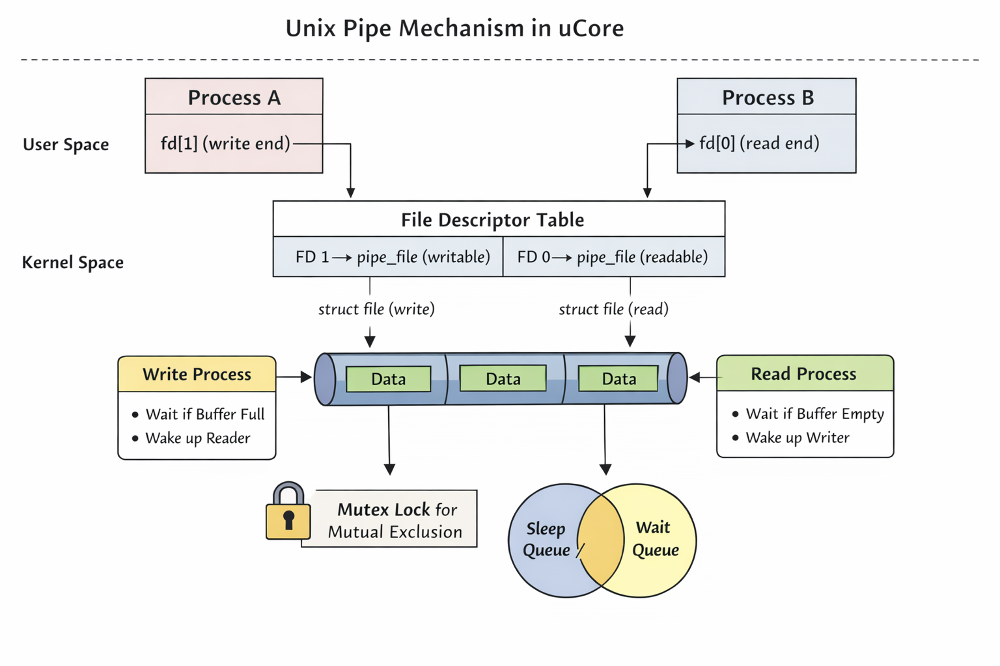
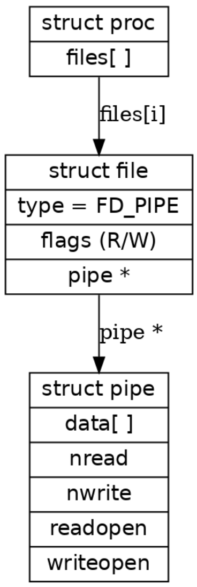
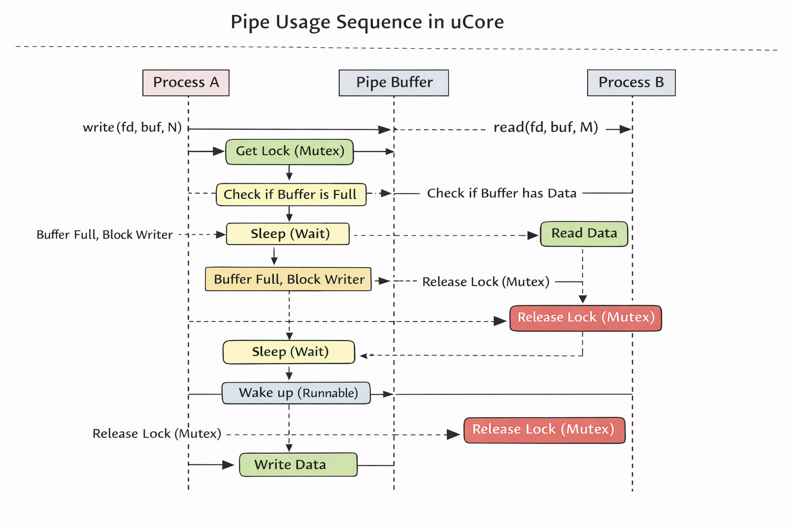

## 练习1: 完成读文件操作的实现（需要编码）

#### 问：首先了解打开文件的处理流程，然后参考本实验后续的文件读写操作的过程分析，填写在 kern/fs/sfs/sfs_inode.c中 的sfs_io_nolock()函数，实现读文件中数据的代码。

答：在` sfs_io_nolock `函数中，我采用以文件偏移为驱动的顺序循环方式，实现了对普通文件数据的连续读写。核心思想是：将任意给定的文件区间` [offset, endpos)` 拆分为若干个磁盘块内的访问操作，并根据访问是否对齐块边界选择合适的` I/O` 接口。

```c
    while (pos < endpos)
    {
        blkno = pos / SFS_BLKSIZE;
        blkoff = pos % SFS_BLKSIZE;
        size = SFS_BLKSIZE - blkoff;
        if (size > endpos - pos)
        {
            size = endpos - pos;
        }

        if ((ret = sfs_bmap_load_nolock(sfs, sin, blkno, &ino)) != 0)
        {
            goto out;
        }

        if (size == SFS_BLKSIZE)
        {
            ret = sfs_block_op(sfs, data, ino, 1);
        }
        else
        {
            ret = sfs_buf_op(sfs, data, size, ino, blkoff);
        }
        if (ret != 0)
        {
            goto out;
        }
        pos += size;
        data += size;
        alen += size;
    }
```

在该循环中，我以当前文件偏移` pos `为驱动，顺序完成对文件区间` [offset, endpos) `的读写操作。每次迭代根据` pos` 计算对应的逻辑块号` blkno` 及块内偏移` blkoff`，并据此确定本次可访问的数据长度 `size`，确保不会越过请求的结束位置。

随后通过 `sfs_bmap_load_nolock` 将逻辑块号映射为实际磁盘块号` ino`。当本次访问覆盖整个磁盘块时，直接调用块级接口`sfs_block_op`；否则使用缓冲区级接口 `sfs_buf_op` 对块内局部数据进行读写。每次操作成功后，更新文件位置、用户缓冲区指针及已完成长度，直至处理完全部请求数据。


## 练习2: 完成基于文件系统的执行程序机制的实现（需要编码）

#### 问：改写proc.c中的load_icode函数和其他相关函数，实现基于文件系统的执行程序机制。执行：make qemu。如果能看看到sh用户程序的执行界面，则基本成功了。如果在sh用户界面上可以执行`exit`, `hello`（更多用户程序放在`user`目录下）等其他放置在`sfs`文件系统中的其他执行程序，则可以认为本实验基本成功。

答：load_icode 的目标是将由文件描述符 fd 指定的 ELF 可执行文件加载到当前进程的用户地址空间中，并正确构造用户态执行环境，使进程能够从 ELF 入口点开始运行，同时在用户栈中按照约定传递参数 argc / argv。

该过程本质上对应操作系统中的 exec 机制，是进程地址空间重建与用户态初始化的核心步骤。

```c
static int
load_icode(int fd, int argc, char **kargv)
{
    if (current->mm != NULL)
    {
        panic("load_icode: current->mm must be empty.\n");
    }

    int ret = -E_NO_MEM;
    struct mm_struct *mm;
    if ((mm = mm_create()) == NULL)
    {
        goto bad_mm;
    }
    if ((ret = setup_pgdir(mm)) != 0)
    {
        goto bad_pgdir_cleanup_mm;
    }

    struct elfhdr elf;
    if ((ret = load_icode_read(fd, &elf, sizeof(struct elfhdr), 0)) != 0)
    {
        goto bad_elf_cleanup_pgdir;
    }
    if (elf.e_magic != ELF_MAGIC)
    {
        ret = -E_INVAL_ELF;
        goto bad_elf_cleanup_pgdir;
    }

    struct proghdr *ph = NULL, *ph_end;
    if ((ph = kmalloc(sizeof(struct proghdr) * elf.e_phnum)) == NULL)
    {
        goto bad_elf_cleanup_pgdir;
    }
    if ((ret = load_icode_read(fd, ph, sizeof(struct proghdr) * elf.e_phnum, elf.e_phoff)) != 0)
    {
        goto bad_free_ph;
    }

    struct Page *page;
    uint32_t vm_flags, perm;
    size_t off, size;
    ph_end = ph + elf.e_phnum;
    for (struct proghdr *p = ph; p < ph_end; p++)
    {
        if (p->p_type != ELF_PT_LOAD)
        {
            continue;
        }
        if (p->p_filesz > p->p_memsz)
        {
            ret = -E_INVAL_ELF;
            goto bad_cleanup_mmap;
        }
        vm_flags = 0, perm = PTE_U | PTE_V;
        if (p->p_flags & ELF_PF_X)
            vm_flags |= VM_EXEC;
        if (p->p_flags & ELF_PF_W)
            vm_flags |= VM_WRITE;
        if (p->p_flags & ELF_PF_R)
            vm_flags |= VM_READ;
        if (vm_flags & VM_READ)
            perm |= PTE_R;
        if (vm_flags & VM_WRITE)
            perm |= (PTE_W | PTE_R);
        if (vm_flags & VM_EXEC)
            perm |= PTE_X;
        if ((ret = mm_map(mm, p->p_va, p->p_memsz, vm_flags, NULL)) != 0)
        {
            goto bad_cleanup_mmap;
        }

        uintptr_t start = p->p_va, end, la = ROUNDDOWN(start, PGSIZE);
        ret = -E_NO_MEM;

        end = p->p_va + p->p_filesz;
        while (start < end)
        {
            if ((page = pgdir_alloc_page(mm->pgdir, la, perm)) == NULL)
            {
                goto bad_cleanup_mmap;
            }
            off = start - la, size = PGSIZE - off, la += PGSIZE;
            if (end < la)
            {
                size -= la - end;
            }
            if ((ret = load_icode_read(fd, page2kva(page) + off, size, p->p_offset + start - p->p_va)) != 0)
            {
                goto bad_cleanup_mmap;
            }
            start += size;
        }

        end = p->p_va + p->p_memsz;
        if (start < la)
        {
            if (start == end)
            {
                continue;
            }
            off = start + PGSIZE - la, size = PGSIZE - off;
            if (end < la)
            {
                size -= la - end;
            }
            memset(page2kva(page) + off, 0, size);
            start += size;
            assert((end < la && start == end) || (end >= la && start == la));
        }
        while (start < end)
        {
            if ((page = pgdir_alloc_page(mm->pgdir, la, perm)) == NULL)
            {
                goto bad_cleanup_mmap;
            }
            off = start - la, size = PGSIZE - off, la += PGSIZE;
            if (end < la)
            {
                size -= la - end;
            }
            memset(page2kva(page) + off, 0, size);
            start += size;
        }
    }

    vm_flags = VM_READ | VM_WRITE | VM_STACK;
    if ((ret = mm_map(mm, USTACKTOP - USTACKSIZE, USTACKSIZE, vm_flags, NULL)) != 0)
    {
        goto bad_cleanup_mmap;
    }

    for (size_t i = 0; i < USTACKPAGE; i++)
    {
        assert(pgdir_alloc_page(mm->pgdir, USTACKTOP - (i + 1) * PGSIZE, PTE_USER) != NULL);
    }

    bool satp_switched = 0;
    lsatp(PADDR(mm->pgdir));
    satp_switched = 1;

    uintptr_t *argv_store = NULL;
    uintptr_t stacktop = USTACKTOP;
    if (argc > 0)
    {
        if ((argv_store = kmalloc(sizeof(uintptr_t) * (argc + 1))) == NULL)
        {
            ret = -E_NO_MEM;
            goto bad_cleanup_mmap;
        }

        for (int i = argc - 1; i >= 0; i--)
        {
            size_t len = strlen(kargv[i]) + 1;
            stacktop -= len;
            if (!copy_to_user(mm, (void *)stacktop, kargv[i], len))
            {
                ret = -E_NO_MEM;
                goto bad_cleanup_mmap;
            }
            argv_store[i] = stacktop;
        }
        stacktop = ROUNDDOWN(stacktop, sizeof(uintptr_t));
        argv_store[argc] = 0;
        stacktop -= (argc + 1) * sizeof(uintptr_t);
        if (!copy_to_user(mm, (void *)stacktop, argv_store, (argc + 1) * sizeof(uintptr_t)))
        {
            ret = -E_NO_MEM;
            goto bad_cleanup_mmap;
        }
    }
    else
    {
        stacktop = USTACKTOP;
    }

    mm_count_inc(mm);
    current->mm = mm;
    current->pgdir = PADDR(mm->pgdir);
    lsatp(PADDR(mm->pgdir));

    struct trapframe *tf = current->tf;
    uintptr_t sstatus = tf->status;
    memset(tf, 0, sizeof(struct trapframe));
    tf->gpr.sp = stacktop;
    tf->gpr.a0 = argc;
    tf->gpr.a1 = (argc > 0) ? stacktop : 0;
    tf->epc = elf.e_entry;
    tf->status = read_csr(sstatus);
    tf->status &= ~SSTATUS_SPP;
    tf->status |= SSTATUS_SPIE;
    ret = 0;

bad_free_ph:
    if (ph != NULL)
    {
        kfree(ph);
    }
bad_close_fd:
    sysfile_close(fd);
out:
    if (argv_store != NULL)
    {
        kfree(argv_store);
    }
    return ret;
bad_elf_cleanup_pgdir:
    if (satp_switched)
    {
        lsatp(boot_pgdir_pa);
    }
    put_pgdir(mm);
    mm_destroy(mm);
    goto bad_close_fd;
bad_cleanup_mmap:
    if (satp_switched)
    {
        lsatp(boot_pgdir_pa);
    }
    exit_mmap(mm);
    put_pgdir(mm);
    mm_destroy(mm);
    goto bad_free_ph;
bad_pgdir_cleanup_mm:
    if (satp_switched)
    {
        lsatp(boot_pgdir_pa);
    }
    mm_destroy(mm);
bad_mm:
    goto bad_close_fd;
}
```

## 1. 基本思路

本实验里，用户程序不是从内存镜像里“直接拿到”的，而是通过**文件描述符 `fd`**从文件系统读取。因此 `load_icode` 要做的事可以理解为：

1. 从 `fd` 读出 ELF 的结构信息（ELF 头 + Program Header）
2. 按 Program Header 把每个可加载段（`PT_LOAD`）映射到用户地址空间
3. 把文件内容拷进去，并把 BSS 补零
4. 建立用户栈并放好 `argc/argv`，最后设置好 trapframe 进入用户态执行

---

## 2. 创建并初始化新的地址空间

进入 `load_icode` 时，要求当前进程还没有用户地址空间，否则说明状态不对：

```c
if (current->mm != NULL)
    panic("load_icode: current->mm must be empty.\n");
```

接着创建并初始化一套新的用户地址空间：

* `mm_create()` 生成新的 `mm_struct`
* `setup_pgdir(mm)` 为该地址空间建立页表（pgdir）

做到这里，进程已经拥有了一份**干净的、空的用户虚拟地址空间**，后续就可以开始往里面“装载程序”。

---

## 3. 通过 fd 读取并解析 ELF

### 3.1 读取 ELF 头并校验格式

程序首先从文件开头读取 ELF 头：

```c
load_icode_read(fd, &elf, sizeof(struct elfhdr), 0);
```

然后检查 `ELF_MAGIC`，确保这是合法的 ELF 可执行文件。这样做的意义是：避免把非 ELF 文件当成程序装载，导致后续解析结构体越界或映射错误。

### 3.2 读取 Program Header Table

ELF 头里给出了程序头表的位置和数量（`e_phoff`、`e_phnum`），于是一次性把所有 program header 读出来：

```c
load_icode_read(fd, ph, sizeof(struct proghdr) * elf.e_phnum, elf.e_phoff);
```

之后遍历 program header，只处理 `p_type == PT_LOAD` 的段，因为只有这些段需要装入内存。

---

## 4. 装载 TEXT / DATA / BSS 段

对每个 `PT_LOAD` 段，整体流程可以分成三步：**先建映射，再拷内容，最后补 BSS**。

### 4.1 建立虚拟内存映射（VMA）

根据该段的 `p_va`（虚拟地址）、`p_memsz`（内存大小）以及 `p_flags`（权限），调用 `mm_map` 在用户地址空间中建立一段 VMA。

同时需要把 ELF 的权限转换为页表权限（例如读 / 写 / 执行对应 `PTE_R / PTE_W / PTE_X`），保证用户态访问权限与 ELF 描述一致。

### 4.2 拷贝文件内容（TEXT / DATA）

段内 `p_filesz` 这部分是文件里真实存在的数据（一般对应 text/data），装载时按页处理：

* 用 `pgdir_alloc_page` 为用户虚拟地址对应的页分配物理页
* 用 `load_icode_read(fd, ...)` 从文件的 `p_offset` 位置读取数据
* 把数据写入新分配的页面中

这里要特别注意：段的起始地址可能不是页对齐的，所以实现通常会做对齐计算（如 `ROUNDDOWN/ROUNDUP`），确保第一页的偏移、最后一页的剩余都处理正确。

### 4.3 初始化 BSS（补零）

当 `p_memsz > p_filesz` 时，多出来的部分就是 BSS（未初始化全局变量区域）。这部分文件里没有数据，所以需要：

* 对还没覆盖到的内存区域继续分配页面
* 用 `memset(..., 0, ...)` 将其清零

这样可以保证用户态看到的未初始化全局变量初始值为 0。

---

## 5. 用户栈建立与 argc / argv 布局

### 5.1 建立用户栈 VMA

通常在用户地址空间的高地址处映射栈区域：

```c
mm_map(mm, USTACKTOP - USTACKSIZE, USTACKSIZE,
       VM_READ | VM_WRITE | VM_STACK, NULL);
```

随后逐页分配物理页，让这段栈空间在页表中真正可用。

### 5.2 用户态期望的参数约定

用户程序启动时一般约定：

* `a0 = argc`
* `a1 = argv`（指向用户地址空间中的 `char **argv`）
* `argv[argc] = NULL`

因此内核要在用户栈里“拼出”两类东西：**字符串本体**和**指针数组 argv**。布局通常是：

```
高地址
[ 参数字符串内容 ... ]   <-- 字符串从高往低放
[ 对齐填充 ]
[ argv[0], argv[1], ... argv[argc]=NULL ]  <-- 指针数组
低地址
```

### 5.3 拷贝策略

实现上一般采用“先放字符串，再放 argv 指针”的方式更稳：

* 先把每个 `kargv[i]` 的字符串拷到用户栈中（常用逆序放置，便于更新栈顶指针）
* 记录每个字符串在**用户空间中的地址**
* 对 `sp` 做必要的对齐（例如 `uintptr_t` 对齐）
* 再把这些“用户地址”组成的指针数组写入用户栈，形成 `argv`

最终得到的 `argv` 指向的是用户栈里那片指针数组，指针数组里的每个元素又指向用户栈里的对应字符串。

---

## 6. 切换页表与初始化 trapframe

当所有段和用户栈都准备好后，需要把进程的执行上下文切到这套新地址空间上：

1. 更新 `current->mm` 与 `current->pgdir`
2. 切换页表：`lsatp(PADDR(mm->pgdir))`
3. 设置 trapframe，让返回用户态时从 ELF 入口开始跑：

* `tf->epc = elf.e_entry`
* `tf->gpr.sp` 指向构造好的用户栈顶
* `tf->gpr.a0 = argc`
* `tf->gpr.a1 = argv`
* 配置 `sstatus`，确保 `sret` 能正确返回用户态执行

到这里，进程的用户态运行环境就完整了。

---

## 7. 错误处理与资源回收

`load_icode` 中间任何一步出错都需要及时回收资源，因此代码通常用 `goto` 统一跳转到清理路径，避免遗漏释放。清理目标一般包括：

* 已创建但未完成的页表 / pgdir
* 已建立的 VMA / mm_struct
* 已分配的物理页
* 恢复 SATP 为内核页表（防止留在错误的用户页表上）

这样能保证失败路径不会泄漏内存，也不会破坏内核当前运行环境。

---


make grade结果

make qemu结果


## 扩展练习 Challenge1：完成基于“UNIX的PIPE机制”的设计方案

如果要在ucore里加入UNIX的管道（Pipe）机制，至少需要定义哪些数据结构和接口？（接口给出语义即可，不必具体实现。数据结构的设计应当给出一个（或多个）具体的C语言struct定义。在网络上查找相关的Linux资料和实现，请在实验报告中给出设计实现”UNIX的PIPE机制“的概要设方案，你的设计应当体现出对可能出现的同步互斥问题的处理。）


### 背景与设计目标
#### 目标在 uCore 中加入 UNIX 风格匿名管道（pipe）机制，使用户态可以通过 `pipe()/read()/write()/close()` 完成进程间单向字节流通信，且满足默认阻塞语义与端点关闭语义（EOF / 写失败）。

#### 与现有代码结构的对应关系（基于本项目树）本项目已具备文件系统与系统调用框架，且在接口层预留了 pipe 相关函数：

- `kern/fs/file.h` 已声明 `file_pipe(int fd[])`、`file_mkfifo(...)`；
- `kern/fs/sysfile.h` 已声明 `sysfile_pipe(int *fd_store)`、`sysfile_mkfifo(...)`；
- `kern/fs/sysfile.c` 中 `sysfile_pipe/sysfile_mkfifo` 目前返回 `-E_UNIMP`；
- 文件读写路径目前为：`syscall.c` → `sysfile.c` → `file.c` → `vop_read/vop_write`（通过 VFS inode 操作表完成多态分发）。

下面给出相关未实现入口的现状：

```c
int sysfile_pipe(int *fd_store) {
    return -E_UNIMP;
}

int sysfile_mkfifo(const char *name, uint32_t open_flags) {
    return -E_UNIMP;
}
```

### 总体机制说明
#### 机制概览（图 1）图 1 展示了 Pipe 的整体工作方式：

- 用户态：进程 A 持有写端 `fd[1]`，调用 `write(fd[1], ...)`；进程 B 持有读端 `fd[0]`，调用 `read(fd[0], ...)`。
- 内核态：两个 fd 在各自进程的 FD 表中对应到 `struct file`；文件对象进一步关联到同一个 pipe 内核对象（缓冲区与状态）。
- 同步互斥：对 pipe 共享状态进行互斥保护；当缓冲区满/空时，通过等待队列让写者/读者阻塞并在条件满足时被唤醒。



#### 结构关系（图 2）：进程通过 `files[]`（或 `files_struct->fd_array`）定位到 `struct file`，再通过文件对象间接访问 pipe 对象。

- `struct proc`（本项目为 `struct proc_struct`）持有 `filesp` 指针；
- `filesp->fd_array[fd]` 对应一个打开的文件表项（`struct file`）；
- pipe 的读端与写端为两个不同的 `struct file`（权限不同），但共享同一个 pipe 内核对象。



#### 典型时序（图 3）图 3 说明阻塞语义如何实现：

- 写者写入前获取互斥锁，检查缓冲区是否已满；
- 若满则写者加入写等待队列并睡眠（睡眠前释放锁，醒来后重新加锁并复查条件）；
- 读者读走数据后唤醒写者；写者继续写入并释放锁；
- 读者遇到缓冲区空时同理阻塞，等待写者写入后被唤醒。

该过程直接对应题目要求的同步互斥处理：互斥用于保护共享状态，同步用于实现 “空则等/满则等” 的阻塞语义。



### 关键设计选择：复用 VFS，多态承载 pipe本项目的 `file_read/file_write` 最终调用 `vop_read/vop_write`，因此本设计选择将 pipe 实现为一种 “特殊 inode”：

- **好处 1：** 无需改动 `sysfile_read/sysfile_write` 的整体框架，仍通过 VFS 分派到不同对象的读写实现；
- **好处 2：** 与项目现有抽象一致：普通文件、设备、pipe 都通过 inode + `inode_ops` 提供统一接口；
- **实现方式：** 为 VFS inode 增加一种 pipe 类型的 `in_type`，并提供 `pipe_inode_ops`（实现 `vop_read/vop_write/vop_close/vop_reclaim` 等）。

### 至少需要定义的数据结构
#### Pipe 核心对象：环形缓冲区 + 同步互斥pipe 本质是 “字节流 + 有界缓冲”，最小需要保存缓冲区、读写位置、端点状态与同步原语。结合本项目已有 `wait_queue_t` 与 `semaphore_t`，如下：

```c
// kern/fs/pipe.h (新增)
#pragma once
#include <defs.h>
#include <wait.h>
#include <sem.h>

#define PIPESIZE 4096

struct pipe {
    // ring buffer
    char     data[PIPESIZE];
    uint32_t nread;     // 累计读出字节数
    uint32_t nwrite;    // 累计写入字节数

    // endpoint state：建议用计数更严谨（支持多进程dup/fork共享）
    int      readers;   // 打开读端的引用数
    int      writers;   // 打开写端的引用数

    // mutual exclusion
    semaphore_t lock;   // 作为互斥锁使用（init为1）

    // blocking / wakeup
    wait_queue_t rwait; // 缓冲空时，读者在此等待
    wait_queue_t wwait; // 缓冲满时，写者在此等待
};
```

**字段含义与不变量**

- `nread == nwrite` 表示缓冲区空；
- `nwrite - nread == PIPESIZE` 表示缓冲区满；
- 实际访问缓冲区使用 `idx = counter % PIPESIZE`；
- `readers/writers` 支持 fork/dup 后多个引用：读端计数为 0 时写入应失败；写端计数为 0 时读取在读空后返回 EOF。

#### VFS inode 扩展：为 pipe 增加 inode 类型当前 `kern/fs/vfs/inode.h` 的 `union in_info` 仅包含 device 和 sfs。为了复用 VFS，需要加入 pipe 的 inode 信息（可仅保存指向 `struct pipe` 的指针）：

```c
// kern/fs/vfs/inode.h (设计：扩展 union 和 in_type)
struct pipe; // forward decl

struct pipe_inode {
    struct pipe *p;
};

// 在 struct inode 的 union in_info 中新增：
//     struct pipe_inode __pipe_inode_info;
//
// 在 enum in_type 中新增：
//     inode_type_pipe_inode_info,
```

**说明**

- inode 的 `in_ops` 指向 `pipe_inode_ops`，使得 `vop_read/vop_write` 自动分派到 pipe 读写；
- `file.c` 中的 `file_read/file_write` 不需要为 pipe 特判，仍调用 `vop_read/vop_write`；
- `file` 结构保持不变：读端与写端由 `file->readable/writable` 控制。

#### Pipe inode 操作表：与 VFS 对接的接口载体
```c
// kern/fs/pipe.c (新增) - pipe inode ops 原型
#include <inode.h>
#include <iobuf.h>

int pipe_vop_open(struct inode *node, uint32_t open_flags);
int pipe_vop_close(struct inode *node);
int pipe_vop_read(struct inode *node, struct iobuf *iob);
int pipe_vop_write(struct inode *node, struct iobuf *iob);
int pipe_vop_reclaim(struct inode *node);

extern const struct inode_ops pipe_inode_ops;
```

### 至少需要定义的接口
#### 系统调用层接口由于内核已采用 `syscall.c` 统一分发，pipe 需要完成两层接入：

##### （1）新增 syscall 号与分发入口- 在 `libs/unistd.h` 增加 `SYS_pipe` 编号；
- 在 `kern/syscall/syscall.c` 增加 `sys_pipe` 并挂入 `syscalls[]`；

```c
// libs/unistd.h (设计：新增)
#define SYS_pipe  131   // 编号可选，需避免与现有冲突
```

```c
// kern/syscall/syscall.c (设计：新增分发)
static int sys_pipe(uint64_t arg[]) {
    int *fd_store = (int *)arg[0];
    return sysfile_pipe(fd_store);
}
// 并在 syscalls[] 中加入： [SYS_pipe] sys_pipe,
```

##### （2）sysfile 层接口语义：sysfile_pipe`kern/fs/sysfile.c` 的职责是完成用户内存拷贝与参数检查，因此 `sysfile_pipe` 的语义应为：

- 检查 `fd_store` 在用户地址空间可写；
- 调用 `file_pipe(int fd[2])` 创建管道并获得两个 fd；
- 将 `fd[0], fd[1]` 拷贝回用户空间；
- 失败时返回负错误码并保证不泄漏资源。

```c
// kern/fs/sysfile.h (已有声明)
int sysfile_pipe(int *fd_store);
```

#### 文件层接口语义：file_pipe`kern/fs/file.h` 已声明 `file_pipe`，其语义应与 fd 表管理一致：

- 在当前进程的 `filesp->fd_array` 中分配两个空闲表项（fd）；
- 分配一个 pipe inode（其 `in_info` 指向新创建的 `struct pipe`）；
- 设置两个 `struct file`：
  - 读端：`readable=1, writable=0, node=pipe_inode`；
  - 写端：`readable=0, writable=1, node=pipe_inode`；
- 增加 inode 引用计数/打开计数（与现有 `fd_array_dup` 行为一致）；
- 返回 `fd[0], fd[1]`。

```c
// kern/fs/file.h (已有声明)
int file_pipe(int fd[]);
```

#### pipe 读写核心语义（阻塞/唤醒/端点关闭）pipe 的核心操作由 `pipe_vop_read/pipe_vop_write` 承载（通过 VFS 进入），其语义如下：

##### pipe_vop_read（读端）- 若缓冲非空：读取尽可能多的数据（不超过请求长度），推进 `nread`；
- 若缓冲为空且仍存在写端（`writers > 0`）：阻塞当前进程，加入 `rwait`；
- 若缓冲为空且写端全部关闭（`writers == 0`）：返回 0（EOF）；
- 每次读走数据后应唤醒写等待队列（`wwait`），因为缓冲可能从满变为可写。

##### pipe_vop_write（写端）- 若读端已全部关闭（`readers == 0`）：返回错误（等价 EPIPE 行为；本项目可用 `-E_PIPE` 或复用 `-E_INVAL` 并在报告中说明）；
- 若缓冲未满：写入尽可能多的数据，推进 `nwrite`；
- 若缓冲已满且仍有读者（`readers > 0`）：阻塞当前进程，加入 `wwait`；
- 每次写入数据后应唤醒读等待队列（`rwait`），因为缓冲可能从空变为可读。

### 同步互斥设计
#### 互斥：保护共享状态pipe 的共享状态包括：`data/nread/nwrite/readers/writers`。为避免并发读写导致状态破坏：

- 在进入读写逻辑前对 `pipe->lock` 做 P 操作（相当于加互斥锁）；
- 在完成状态更新与必要的唤醒操作后对 `pipe->lock` 做 V 操作（释放互斥锁）；
- 任何 “检查条件 → 修改状态” 的逻辑必须在同一临界区内完成，避免竞态。

#### 同步：阻塞与唤醒（避免忙等）本项目已有 `wait_queue_t` 与 `wait_current_set()` / `wakeup_queue()`，用于 pipe 的阻塞语义：

- 当读者发现缓冲为空且 `writers>0`：
  1. 释放 `pipe->lock`；
  2. `wait_current_set(&p->rwait, &wait, WT_PIPE);`；
  3. 调用调度器让出 CPU（例如 `schedule()`），睡眠等待；
  4. 被唤醒后重新获取 `pipe->lock` 并复查条件。
- 当写者发现缓冲已满且 `readers>0`：对称地加入 `p->wwait` 并睡眠；
- 读写完成后分别唤醒对方队列，以保证条件推进。

#### 端点关闭的同步语义（防止永久阻塞）必须处理 “另一端已经关闭” 的情况，否则会出现永远睡眠：

- 关闭写端（`writers--` 到 0）后：唤醒所有读者（`wakeup_queue(&p->rwait, ...)`），使其返回 EOF；
- 关闭读端（`readers--` 到 0）后：唤醒所有写者，使其返回写失败错误；
- 当 `readers==0 && writers==0` 时回收 pipe 对象及其 inode（由 `vop_reclaim` 或引用计数路径触发）。

### 与现有模块的落点
#### 新增文件- `kern/fs/pipe.h`：定义 `struct pipe` 与对外声明；
- `kern/fs/pipe.c`：实现 pipe inode ops（`pipe_vop_read/write/close/reclaim`）与 pipe 的创建/销毁辅助函数。

#### 修改文件- `kern/fs/sysfile.c`：实现 `sysfile_pipe`（参数检查 + 拷贝 + 调用 `file_pipe`）；
- `kern/fs/file.c`：实现 `file_pipe`（分配 fd + 构建 pipe inode + 初始化 file 表项）；
- `kern/fs/vfs/inode.h & inode.c`：扩展 inode 类型并支持分配 pipe inode；
- `libs/unistd.h`：增加 `SYS_pipe`；
- `kern/syscall/syscall.c`：增加 `sys_pipe` 并加入 syscalls 表；
- `user/libs/syscall.c & syscall.h`：增加用户态系统调用封装 `sys_pipe`。

### 边界情况与一致性说明- **EOF：** 写端全部关闭后，读端在读空缓冲后返回 0；
- **写失败：** 读端全部关闭后，写端写入返回错误；
- **多进程共享：** 通过 fork/dup 产生多个引用时，使用 `readers/writers` 计数保证语义正确；
- **阻塞正确性：** 睡眠前释放互斥锁，醒来后重新加锁并复查条件，避免死锁与丢失唤醒。

### 小结：本设计在不破坏现有文件系统调用链的前提下，将 pipe 作为一种特殊 inode 接入 VFS，多态承载 `read/write/close` 行为；pipe 内部通过互斥锁与读写等待队列实现 “空则等/满则等” 的阻塞语义，并通过端点引用计数保证 EOF 与写失败行为正确，满足题目对数据结构、接口语义与同步互斥处理的要求。


#### 扩展练习 Challenge2：完成基于“UNIX的软连接和硬连接机制”的设计方案

如果要在ucore里加入UNIX的软连接和硬连接机制，至少需要定义哪些数据结构和接口？（接口给出语义即可，不必具体实现。数据结构的设计应当给出一个（或多个）具体的C语言struct定义。在网络上查找相关的Linux资料和实现，请在实验报告中给出设计实现”UNIX的软连接和硬连接机制“的概要设方案，你的设计应当体现出对可能出现的同步互斥问题的处理。）

#### 1. 总体设计思路

在 ucore 的 Simple File System (SFS) 中引入 UNIX 风格的链接机制，主要是将文件系统的**目录树结构**与**物理数据存储**分开，即让文件名只是一个标签，文件数据归文件数据存。这样，一份数据就可以贴好几个不同的标签（硬链接），或者一个标签指向另一个标签（软链接）。。

- **硬链接 (Hard Link)**：利用索引节点（Inode）的**引用计数**机制，允许不同的目录项指向同一个 Inode。
- **软链接 (Symbolic Link)**：引入一种新的文件类型，其数据块中存储的内容不再是普通数据，而是指向另一个文件的**路径字符串**。

#### 2. 数据结构设计

根据 SFS 文件系统的定义（参考 `sfs.h`），实现链接机制需要利用以下核心数据结构。

##### 2.1 磁盘索引节点设计 (`struct sfs_disk_inode`)

这是文件元数据在磁盘上的结构。主要是复用 `nlinks` 字段和扩展 `type` 字段。

```c
struct sfs_disk_inode {
    uint32_t size;                  // 文件大小
    uint16_t type;                  // 文件类型
    uint16_t nlinks;                // 硬链接计数
    uint32_t blocks;                // 块数量
    uint32_t direct[SFS_NDIRECT];   // 直接索引
    uint32_t indirect;              // 间接索引
};
```

- **`nlinks`**：用于硬链接计数。创建文件时初始化为 1。每增加一个硬链接，该值 +1。每删除一个硬链接，该值 -1。只有当 `nlinks == 0` 且内存中无进程引用时，才回收该 inode。
- **`type`**：用于标识软链接。 `type == SFS_TYPE_LINK` 时，系统将该文件的数据块内容解释为路径。

##### 2.2 内存文件系统控制块 (`struct sfs_fs`)

用于管理文件系统全局状态，主要是用同步互斥的锁。

```c
struct sfs_fs {
    // ... 其他字段 ...
    semaphore_t mutex_sem;          // 文件系统级互斥锁
    // ...
};
```

- **`mutex_sem`**：一个大粒度的互斥锁。设计要求在进行涉及目录结构变更的操作（如 `link`, `unlink`, `rename`）时必须持有此锁，以维护目录树的一致性。

##### 2.3 内存索引节点 (`struct sfs_inode`)

用于内存中的文件操作。

```C
struct sfs_inode {
    struct sfs_disk_inode *din;     // 对应的磁盘 inode
    // ...
    semaphore_t sem;                //Inode 级读写锁
};
```

- **`sem`**：用于保护单个 Inode 的内部数据。在修改 `nlinks` 计数时用此锁。

------

#### 3. 接口设计与语义

需要在 VFS 层与 SFS 层之间定义以下操作接口。

##### 3.1 硬链接接口: `vop_link`

在指定目录 `dir` 下创建一个名为 `name` 的新目录项，使其直接指向源节点 `node` 对应的 Inode。它不分配新 Inode，仅增加源 Inode 的 `nlinks` 计数。

- **参数**：
  - `dir`: 目标目录的 Inode。
  - `name`: 新链接的文件名。
  - `node`: 被链接的源文件 Inode。
- **返回值**：0 表示成功，非 0 表示错误码（如目标已存在、源为目录等）。

##### 3.2 软链接接口: `vop_symlink`

在指定目录 `dir` 下创建一个名为 `name` 的新文件，其类型为 `SFS_TYPE_LINK`，内容为 `path` 字符串。它分配新 Inode，分配数据块，将 `path` 写入数据块。

- **参数**：
  - `dir`: 目标目录的 Inode。
  - `name`: 软链接的文件名。
  - `path`: 软链接指向的目标路径。

##### 3.3 读软链接接口: `vop_readlink`

读取软链接文件 `node` 中存储的路径信息。像读普通文件一样读取数据块内容，但仅供系统路径解析使用。

- **参数**：
  - `node`: 软链接文件的 Inode。
  - `iob`: 用于回传数据的 I/O 缓冲区。

##### 3.4 删除链接接口: `vop_unlink`

从目录 `dir` 中移除名为 `name` 的目录项，并递减对应 Inode 的硬链接计数。如果递减后 `nlinks == 0`，则标记该 Inode 待回收。

------

#### 4. 概要设计方案

##### 4.1 硬链接操作流程

1. **检查合法性**：检查源节点是否为目录。
2. **并发保护**：锁定文件系统 (`lock_sfs_fs`) 和源节点 (`lock_sin`)。
3. **更新元数据**：将源 Inode 的 `nlinks` 加 1，并标记 Inode 为 Dirty。
4. **创建目录项**：在目标目录的数据块中写入 `(name, source_ino)` 映射。
5. **落盘**：将修改后的 Inode 和目录块写回磁盘。

##### 4.2 软链接操作流程

1. **创建节点**：分配一个新的 Inode，设置 `type = SFS_TYPE_LINK`。
2. **写入数据**：将目标路径字符串作为文件内容写入 Inode 关联的数据块。
3. **建立映射**：在父目录中创建目录项指向这个新 Inode。
4. **路径解析修改**：修改 VFS 的 `lookup` 逻辑，当遇到 `SFS_TYPE_LINK` 时，触发 `vop_readlink` 读取路径并插入当前解析序列。

##### 4.3 删除链接 (Unlink) 与资源回收流程

1. **删除映射**：在父目录中删除对应的文件名条目。
2. **递减计数**：对应文件的 Inode `nlinks` 减 1。
3. **条件回收**：
   - 若 `nlinks > 0`：仅更新 Inode 并保存。
   - 若 `nlinks == 0`：检查内存引用计数 (`reclaim_count`)。如果也为 0，则释放该 Inode 及其占用的所有数据块（Bitmap 位置 1）。

------

#### 5. 同步互斥问题的处理

在多进程操作系统中，文件系统操作必须具备原子性，否则可能导致文件丢失或文件系统损坏。本设计采用**两级锁机制**：

##### 5.1 第一级：文件系统锁 (`sfs_fs.mutex_sem`)

用于保护目录树结构的一致性。即在执行 `link`、`symlink`、`unlink` 的最外层操作中，持有 `sfs->mutex_sem`。确保目录项的增删和 Inode 的查找是一个原子过程。
**应用场景**：

  - 防止“A 进程正在目录下创建链接”的同时，“B 进程删除了该目录”。
  - 防止“A 进程正在链接文件 X”的同时，“B 进程删除了文件 X”。


##### 5.2 第二级：索引节点锁 (`sfs_inode.sem`)

用于保护单个文件元数据（特别是 `nlinks`）的一致性。即在修改 `sin->din->nlinks` 字段前后，必须持有 `sin->sem`。
**应用场景**： 防止两个进程同时对同一个文件创建硬链接，导致 `nlinks` 计算错误（例如两个进程读到 1，都写回 2，实际应为 3）。

##### 5.3 死锁预防

用以下的严格的层级加锁顺序可以有效避免 AB-BA 类型的死锁。

- **加锁顺序**：严格遵守 **先获取 FS 级锁，再获取 Inode 级锁** 的顺序。
- **解锁顺序**：严格遵守 **先释放 Inode 级锁，再释放 FS 级锁** 的顺序。


## 心得体会

通过本实验，我们对 uCore 中文件系统、程序装载以及进程执行机制形成了较为完整的实现级认识。相比只在 OS 原理课中学习抽象概念，这次实验让我们真正看到这些机制在内核中是如何一步步被实现出来的。

首先，在实现 sfs_io_nolock 的读文件逻辑时，我们对“文件是线性字节序列”这一抽象有了更直观的理解。文件系统需要将连续的逻辑偏移转换为离散的磁盘块访问，并正确处理块对齐与块内偏移问题。实验代码清晰地体现了从文件偏移到磁盘块号再到具体 I/O 操作的映射过程，使我们认识到文件系统本质上是在屏蔽底层块设备的复杂性，为上层提供统一的字节流视图。

其次，在 load_icode 的实现过程中，我们实现了基于文件系统的 exec 机制。该过程涉及 ELF 解析、虚拟内存映射、物理页分配、BSS 清零以及用户栈和 argc/argv 的构造。原理课中“进程装载并从入口点开始执行”这一描述，在实验中被拆解为一系列严谨而具体的步骤，也让我们清楚地理解了进程地址空间是如何被重建的，以及内核如何为用户态程序准备运行环境。

在扩展练习中设计 UNIX pipe 机制时，我们体会到同步互斥问题在内核设计中的重要性。pipe 的阻塞语义并不是简单的读写操作，而是围绕共享缓冲区状态建立严格的不变量，并通过互斥锁与等待队列保证并发正确性。这一过程加深了我们对“空则等、满则等”这一经典同步模型的理解。

总体来看，本实验将文件系统、内存管理、进程控制和同步机制串联起来，使我们从实现角度理解了操作系统各模块之间的协作关系。虽然实验采用的是简化模型，但它为理解真实操作系统中更复杂的机制（如页缓存、按需加载、日志文件系统等）打下了扎实基础。
